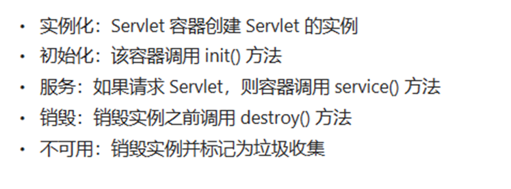
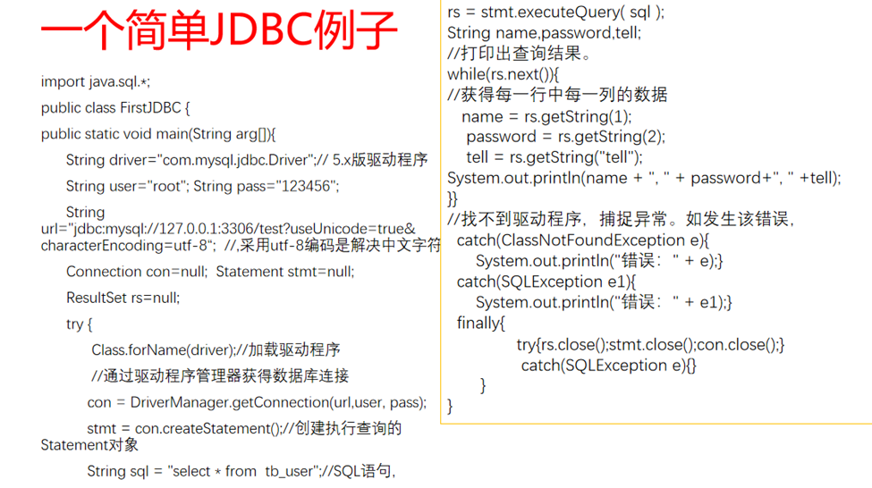
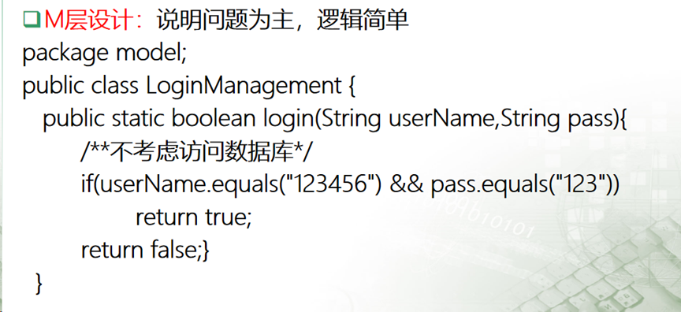
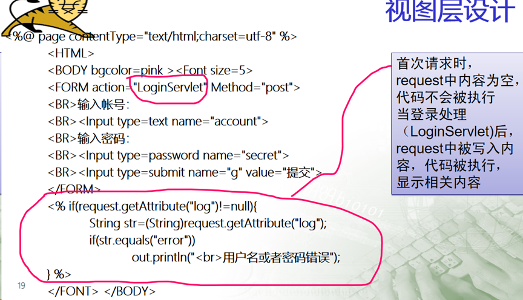
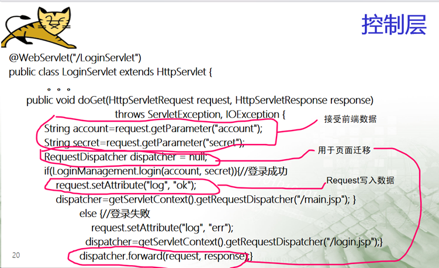
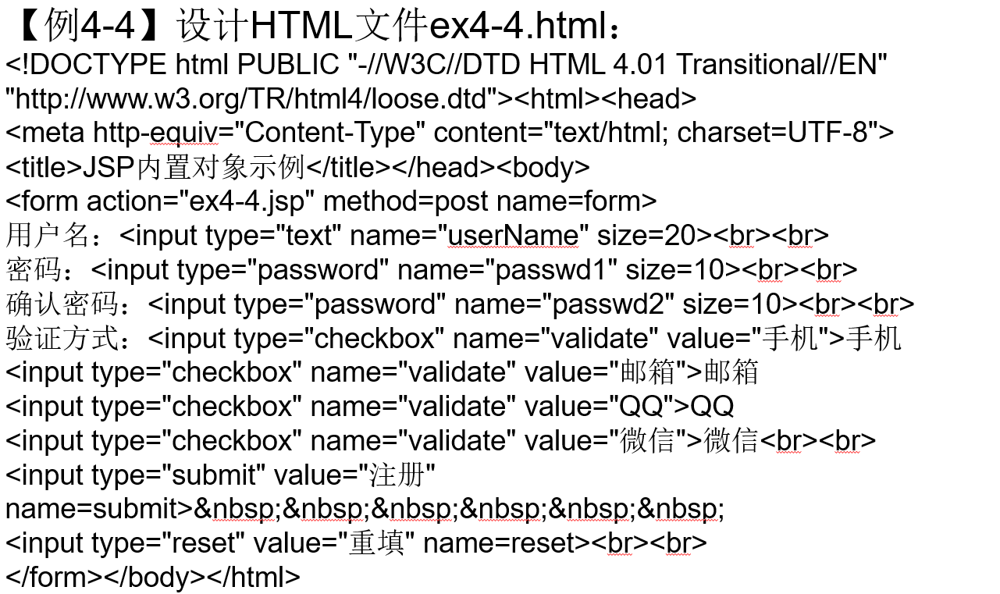

# 特别感谢：
[@終客(zhongke-dhskj)](/zhongke-dhskj)
[@atonement(atonement-zvfm3)](/atonement-zvfm3)
[@玉锦(yujin-kfim3)](/yujin-kfim3)
打赏请移步：


# 知识点整理

1. **Web应用程序的两个优点，常用的Web开发语言有哪些（可以结合框架分层说明）。**

Web应用程序的两个优点：

1.  跨平台性（Cross-Platform Compatibility）： Web应用程序可以通过浏览器在各种设备和操作系统上运行，而无需用户安装任何特定的软件。这种跨平台性使得用户能够在不同的设备上无缝地访问和使用应用程序，提高了灵活性和可访问性。 
2.  实时更新和维护（Real-time Updates and Maintenance）： 通过Web应用程序，开发者可以轻松地对应用程序进行实时更新和维护。用户无需手动下载和安装更新，只需刷新浏览器即可访问应用程序的最新版本。这降低了维护的复杂性，同时确保用户始终获得最新的功能和安全性。 

常用的Web开发语言和框架：

1.  JavaScript： 
   - 框架： 
      - React.js： 用于构建用户界面的JavaScript库，常用于单页面应用程序（SPA）。
      - Angular.js： 一个由Google维护的前端框架，支持构建动态、单页面应用程序。
      - Vue.js： 一款渐进式JavaScript框架，易于集成和使用。
2.  Python： 
   - 框架： 
      - Django： 一个高级的Python Web框架，提供了快速开发和强大的功能，适用于大型应用程序。
      - Flask： 轻量级的Python Web框架，适用于小型和中型应用程序，灵活且易于学习。
3.  Java： 
   - 框架： 
      - Spring Boot： 基于Java的框架，简化了Spring应用程序的开发，特别适用于构建微服务架构。
4.  Ruby： 
   - 框架： 
      - Ruby on Rails（Rails）： 一个用Ruby编写的Web应用框架，注重简洁和开发效率。
5.  PHP： 
   - 框架： 
      - Laravel： 一个流行的PHP框架，提供了许多现代Web应用开发所需的功能和工具。
6.  C#（C Sharp）： 
   - 框架： 
      - ASP.NET Core： 一个跨平台的高性能框架，用于构建现代、云原生、可扩展的Web应用程序。

2. **Servlet容器通常如何管理容器创建的Servlet实例(从创建、定位、调用、销毁等方面说明)**
**Servlet容器通常如何管理容器创建的Servlet实例(从创建、定位、调用、销毁等方面说明)**

3. **JSP代码实际上是由HTML和Java代码构成，试叙述JSP页面执行过程。**
**JSP代码实际上是由HTML和Java代码构成，试叙述JSP页面执行过程。**JavaServer Pages（JSP）是一种用于在服务器端生成动态Web页面的技术。JSP页面执行过程包括以下步骤：

1.  客户端请求： 用户在浏览器中输入URL或者点击页面链接，向服务器发起请求。 
2.  Web容器接收请求： Web容器（例如Tomcat）接收到客户端的请求。 
3.  JSP编译： 如果是首次请求JSP页面，或者JSP页面被修改过，容器将JSP页面编译成Servlet。这个Servlet包含Java代码，与HTML标记相结合。 
4.  Servlet执行： 编译后的Servlet被加载到内存中，然后执行。在这个阶段，Java代码中的业务逻辑被执行，生成动态内容。 
5.  生成HTML响应： 在Servlet执行的过程中，动态生成的内容被嵌入到HTML页面中。这个合成的HTML页面作为响应返回给Web容器。 
6.  Web容器发送响应： Web容器将生成的HTML页面作为响应发送回客户端浏览器。 
7.  浏览器解析和显示**：** 客户端浏览器接收到HTML响应后，解析HTML、CSS和JavaScript，并将页面呈现给用户。 

4. **第三章内置对象知识点中，session对象和application对象的作用及其数据存取方法。**
**第三章内置对象知识点中，session对象和application对象的作用及其数据存取方法。**
- Session对象封装了属于客户会话的所有信息。
- Session对象中用来设置指定名字的属性的方法是setAttribute() 方法  。 
- Session对象中用来获得指定名字的属性的方法是getAttribute() 方法  。 
- Application 对象用于多个程序或者多个用户之间共享数据。 
- Application对象中用来设置指定名字的属性的方法是setAttribute() 方法  。 
- Application对象中用来获得指定名字的属性的方法是getAttribute() 方法  。 
5. **第四章知识点中，什么是Ajax。**
**第四章知识点中，什么是Ajax。**AJAX全称为Asynchronous JavaScript And XML，指的是一种用于创建异步Web应用程序的技术。它可以让Web应用程序在不刷新整个页面的情况下向服务器发起请求和接收响应数据，从而提高了用户体验。

6. **第四章知识点中，如何把一个JSON字符串转换成JavaScript对象。**
```json
var jsonStr = '{"name":"Tom","age":18}';var obj = JSON.parse(jsonStr);
```

7. **第四章知识点中，如何在JSON中表示数组。**

在JSON中，可以使用方括号将多个值包含在一起形成数组。例如:[1, 2, 3]

8. **Axios请求格式。**
```javascript
axios({JSON对象})
  .then(function{(response)})
  .catch(function(error){异常});
```

9. **Spring与SpringMVC技术知识点中，什么是Spring的两大核心功能。**

依赖注入 控制反转

10. **Spring与SpringMVC技术知识点中，属性依赖注入有几种方式，分别怎么实现属性的依赖注入。**
**Spring与SpringMVC技术知识点中，属性依赖注入有几种方式，分别怎么实现属性的依赖注入。**
- 属性setter方法注入和p命名空间
- 构造参数注入和c命名空间
- 使用注解注入
11. **SpringBoot框架技术知识点中，叙述Springboot。**
**SpringBoot框架技术知识点中，叙述Springboot。**springboot是一种快速使用spring框架的简便方式，springboot简单来说相当于一个程序搭建的脚手架，最大的作用就是能够帮助我们快速构建项目，并且尽可能的减少xml的配置文件，让程序的开发更加的简单，开箱即用，快速上手，让我们在程序开发的过程中能够将更多的精力去关注到程序的业务逻辑，而并非是配置文件

12. **数据库访问层知识点中，叙述DAO。**
**数据库访问层知识点中，叙述DAO。**DAO（Data Access Object）是一种设计模式，用于将应用程序的业务逻辑和数据库操作分离。DAO主要负责在应用程序和数据库之间建立一个抽象层，通过这个抽象层来执行数据库操作，使得业务逻辑代码和数据库操作代码相互独立，提高代码的可维护性和可测试性。

13. **数据库访问层知识点中，说说分页技术的几种实现方案。**
**数据库访问层知识点中，说说分页技术的几种实现方案。**每次翻页的时候，只从数据库里检索出页面大小的数据块。这样做，虽然每次翻页都需要查询数据库，但由于查询出的记录数很少，因此查询速度快，如果使用连接池技术，更可以略过最耗时的建立数据库
连接过程，而在数据库端，有各种成熟的优化技术用于提高查询速度因此，该种查对较优。本节只介绍这种方法的实现。
分页还可以通过数据库的存储技术来实现，该种方法把分页过程的业务逻辑委托给具体数据库中实现，因此，其速度是最快的。但由于该种方法与具体数据库相关，因此移植性差，可重用性也差。

14. **Web应用系统与我们的日常生活息息相关，从社会、健康、安全、法律、文化以及环境等因素分析和讨论Web应用系统的作用和影响。**

（这个随便你怎么扯）

15. **开发Web项目，在项目开发过程中如何分工协作，有哪些注意事项。**

（这个随便你怎么扯）

16. **第二次上机作业用JDBC读取表格数据并显示在页面。**
```javascript
请写出使用Statement对象检索学生数据库表记录的代码。（要求有注释）
Connection conn=DriverManager.getConnection(url,user,password); 
//连接数据库
String sql="select * from students";      //构造SQL语句
Statement stmt=conn.createStatement();          //创建Statement对象
ResultSet rs=stmt.executeQuery(sql);    
//执行SQL查询，并将结果返回给ResultSet对象
while(rs.next()) {
            System.out.println(rs.getString("stuID")+rs.getString("stuName"))
}	//循环部分遍历结果集，输出学生姓名列表
rs.close();
stmt.close();
conn.close();   // 关闭连接
```


17. **第五次上机作业用Springboot框架，从前端和后端开发学生信息管理系统，从四层实现学生信息的增删改查。**

（这个有了上下文随便你怎么写）
@RequestMapping(“/..../{name}”)
@PathVariable(“name”)String name
@GetMapping(“/get/{id}/{userid}”)

18. 第三次上机作业，也课题说第二章PPT的18页-20页的代码。



此处@webServlet("/LoginServlet")类似于contoller层的@requestMapping("/LoginServlet")注解


19. 第四章PPT的20页的代码。


