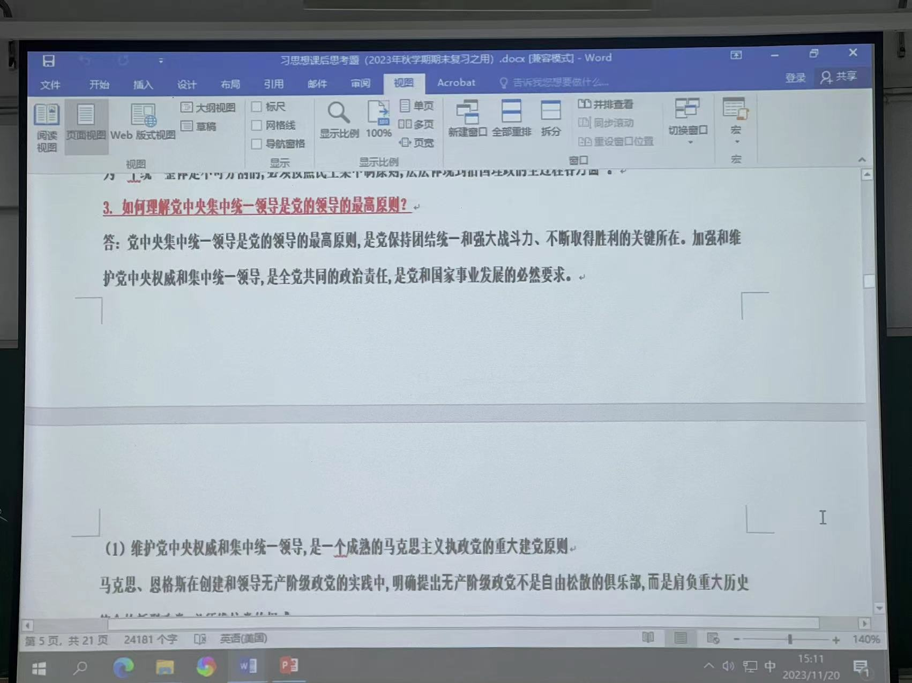

这是隔壁班老师给的重点

[习思想.docx](https://www.yuque.com/attachments/yuque/0/2023/docx/34023817/1700470410161-912831c4-4e4c-418d-b2fe-cb4503372bc5.docx)

这是自己班老师给的重点：
大题（出自每章最后的思考题）：

1. 1,2
2. 1,2,3
3. 1,2,3
4. 1,2,3
5. 1,2
6. 1,2

八、1，2，4
九、1，2，4
十、4
十二、1，2

小题（选择+填空）：出自自测题
下面的文档中大题目通通不要看！
[00导论-自测题-李永.docx](https://www.yuque.com/attachments/yuque/0/2023/docx/34023817/1700470957117-f67a5f58-7af2-4b42-a394-3e416466fe9b.docx?_lake_card=%7B%22src%22%3A%22https%3A%2F%2Fwww.yuque.com%2Fattachments%2Fyuque%2F0%2F2023%2Fdocx%2F34023817%2F1700470957117-f67a5f58-7af2-4b42-a394-3e416466fe9b.docx%22%2C%22name%22%3A%2200%E5%AF%BC%E8%AE%BA-%E8%87%AA%E6%B5%8B%E9%A2%98-%E6%9D%8E%E6%B0%B8.docx%22%2C%22size%22%3A22687%2C%22ext%22%3A%22docx%22%2C%22source%22%3A%22%22%2C%22status%22%3A%22done%22%2C%22download%22%3Atrue%2C%22taskId%22%3A%22uca5e25a9-1cb2-41aa-a6c5-68a0d91b52a%22%2C%22taskType%22%3A%22upload%22%2C%22type%22%3A%22application%2Fvnd.openxmlformats-officedocument.wordprocessingml.document%22%2C%22__spacing%22%3A%22both%22%2C%22mode%22%3A%22title%22%2C%22id%22%3A%22u1cd0970c%22%2C%22margin%22%3A%7B%22top%22%3Atrue%2C%22bottom%22%3Atrue%7D%2C%22card%22%3A%22file%22%7D)
[01第一章 自测题.docx](https://www.yuque.com/attachments/yuque/0/2023/docx/34023817/1700470957120-d47d3797-4c8b-45d1-8b33-01067b1b5ac6.docx?_lake_card=%7B%22src%22%3A%22https%3A%2F%2Fwww.yuque.com%2Fattachments%2Fyuque%2F0%2F2023%2Fdocx%2F34023817%2F1700470957120-d47d3797-4c8b-45d1-8b33-01067b1b5ac6.docx%22%2C%22name%22%3A%2201%E7%AC%AC%E4%B8%80%E7%AB%A0%20%E8%87%AA%E6%B5%8B%E9%A2%98.docx%22%2C%22size%22%3A20886%2C%22ext%22%3A%22docx%22%2C%22source%22%3A%22%22%2C%22status%22%3A%22done%22%2C%22download%22%3Atrue%2C%22taskId%22%3A%22u746eaca1-4f62-4ee4-b0e9-ff7ff680b17%22%2C%22taskType%22%3A%22upload%22%2C%22type%22%3A%22application%2Fvnd.openxmlformats-officedocument.wordprocessingml.document%22%2C%22__spacing%22%3A%22both%22%2C%22mode%22%3A%22title%22%2C%22id%22%3A%22ucb60ec40%22%2C%22margin%22%3A%7B%22top%22%3Atrue%2C%22bottom%22%3Atrue%7D%2C%22card%22%3A%22file%22%7D)
[02第二章 自测题（高）.docx](https://www.yuque.com/attachments/yuque/0/2023/docx/34023817/1700470957107-de20a8e1-7d36-4040-af84-834eeed09a75.docx?_lake_card=%7B%22src%22%3A%22https%3A%2F%2Fwww.yuque.com%2Fattachments%2Fyuque%2F0%2F2023%2Fdocx%2F34023817%2F1700470957107-de20a8e1-7d36-4040-af84-834eeed09a75.docx%22%2C%22name%22%3A%2202%E7%AC%AC%E4%BA%8C%E7%AB%A0%20%E8%87%AA%E6%B5%8B%E9%A2%98%EF%BC%88%E9%AB%98%EF%BC%89.docx%22%2C%22size%22%3A16069%2C%22ext%22%3A%22docx%22%2C%22source%22%3A%22%22%2C%22status%22%3A%22done%22%2C%22download%22%3Atrue%2C%22taskId%22%3A%22uee2f455c-a0c8-46d3-8359-f47531b8600%22%2C%22taskType%22%3A%22upload%22%2C%22type%22%3A%22application%2Fvnd.openxmlformats-officedocument.wordprocessingml.document%22%2C%22__spacing%22%3A%22both%22%2C%22mode%22%3A%22title%22%2C%22id%22%3A%22u73b37693%22%2C%22margin%22%3A%7B%22top%22%3Atrue%2C%22bottom%22%3Atrue%7D%2C%22card%22%3A%22file%22%7D)
[03第三章 自测题（张）.docx](https://www.yuque.com/attachments/yuque/0/2023/docx/34023817/1700470957094-1e18fd71-f176-4eed-be30-e594d1ded550.docx?_lake_card=%7B%22src%22%3A%22https%3A%2F%2Fwww.yuque.com%2Fattachments%2Fyuque%2F0%2F2023%2Fdocx%2F34023817%2F1700470957094-1e18fd71-f176-4eed-be30-e594d1ded550.docx%22%2C%22name%22%3A%2203%E7%AC%AC%E4%B8%89%E7%AB%A0%20%E8%87%AA%E6%B5%8B%E9%A2%98%EF%BC%88%E5%BC%A0%EF%BC%89.docx%22%2C%22size%22%3A17638%2C%22ext%22%3A%22docx%22%2C%22source%22%3A%22%22%2C%22status%22%3A%22done%22%2C%22download%22%3Atrue%2C%22taskId%22%3A%22u4c155017-6ab8-40b1-beda-8ce76bf0e72%22%2C%22taskType%22%3A%22upload%22%2C%22type%22%3A%22application%2Fvnd.openxmlformats-officedocument.wordprocessingml.document%22%2C%22__spacing%22%3A%22both%22%2C%22mode%22%3A%22title%22%2C%22id%22%3A%22u156b9dec%22%2C%22margin%22%3A%7B%22top%22%3Atrue%2C%22bottom%22%3Atrue%7D%2C%22card%22%3A%22file%22%7D)
[04第四章 自测题.docx](https://www.yuque.com/attachments/yuque/0/2023/docx/34023817/1700470957111-d0f59a2c-2860-4467-a324-400ee03d93fd.docx?_lake_card=%7B%22src%22%3A%22https%3A%2F%2Fwww.yuque.com%2Fattachments%2Fyuque%2F0%2F2023%2Fdocx%2F34023817%2F1700470957111-d0f59a2c-2860-4467-a324-400ee03d93fd.docx%22%2C%22name%22%3A%2204%E7%AC%AC%E5%9B%9B%E7%AB%A0%20%E8%87%AA%E6%B5%8B%E9%A2%98.docx%22%2C%22size%22%3A19540%2C%22ext%22%3A%22docx%22%2C%22source%22%3A%22%22%2C%22status%22%3A%22done%22%2C%22download%22%3Atrue%2C%22taskId%22%3A%22u3710ce12-8769-468c-8a09-ede22b44537%22%2C%22taskType%22%3A%22upload%22%2C%22type%22%3A%22application%2Fvnd.openxmlformats-officedocument.wordprocessingml.document%22%2C%22__spacing%22%3A%22both%22%2C%22mode%22%3A%22title%22%2C%22id%22%3A%22u7b0505ff%22%2C%22margin%22%3A%7B%22top%22%3Atrue%2C%22bottom%22%3Atrue%7D%2C%22card%22%3A%22file%22%7D)
[05第五章-章节测试题(1).doc](https://www.yuque.com/attachments/yuque/0/2023/doc/34023817/1700470957458-8d7df2c4-a4c4-4557-9107-fd40878421ab.doc?_lake_card=%7B%22src%22%3A%22https%3A%2F%2Fwww.yuque.com%2Fattachments%2Fyuque%2F0%2F2023%2Fdoc%2F34023817%2F1700470957458-8d7df2c4-a4c4-4557-9107-fd40878421ab.doc%22%2C%22name%22%3A%2205%E7%AC%AC%E4%BA%94%E7%AB%A0-%E7%AB%A0%E8%8A%82%E6%B5%8B%E8%AF%95%E9%A2%98(1).doc%22%2C%22size%22%3A15360%2C%22ext%22%3A%22doc%22%2C%22source%22%3A%22%22%2C%22status%22%3A%22done%22%2C%22download%22%3Atrue%2C%22taskId%22%3A%22u3be5be2e-2445-46d6-9b6b-a5eac88671f%22%2C%22taskType%22%3A%22upload%22%2C%22type%22%3A%22application%2Fmsword%22%2C%22__spacing%22%3A%22both%22%2C%22mode%22%3A%22title%22%2C%22id%22%3A%22ucdfbf027%22%2C%22margin%22%3A%7B%22top%22%3Atrue%2C%22bottom%22%3Atrue%7D%2C%22card%22%3A%22file%22%7D)
[05第五章-章节测试题.doc](https://www.yuque.com/attachments/yuque/0/2023/doc/34023817/1700470957467-4a0291ba-33e8-49e1-b1ae-903da46e6e5a.doc?_lake_card=%7B%22src%22%3A%22https%3A%2F%2Fwww.yuque.com%2Fattachments%2Fyuque%2F0%2F2023%2Fdoc%2F34023817%2F1700470957467-4a0291ba-33e8-49e1-b1ae-903da46e6e5a.doc%22%2C%22name%22%3A%2205%E7%AC%AC%E4%BA%94%E7%AB%A0-%E7%AB%A0%E8%8A%82%E6%B5%8B%E8%AF%95%E9%A2%98.doc%22%2C%22size%22%3A15360%2C%22ext%22%3A%22doc%22%2C%22source%22%3A%22%22%2C%22status%22%3A%22done%22%2C%22download%22%3Atrue%2C%22taskId%22%3A%22u68b3a957-f9c5-4e0a-8ca2-4f27dd51fc1%22%2C%22taskType%22%3A%22upload%22%2C%22type%22%3A%22application%2Fmsword%22%2C%22__spacing%22%3A%22both%22%2C%22mode%22%3A%22title%22%2C%22id%22%3A%22uc53520a6%22%2C%22margin%22%3A%7B%22top%22%3Atrue%2C%22bottom%22%3Atrue%7D%2C%22card%22%3A%22file%22%7D)
[06第六章推动高质量发展练习题.docx](https://www.yuque.com/attachments/yuque/0/2023/docx/34023817/1700470957462-1eca8089-4631-418e-be71-c1af178a5310.docx?_lake_card=%7B%22src%22%3A%22https%3A%2F%2Fwww.yuque.com%2Fattachments%2Fyuque%2F0%2F2023%2Fdocx%2F34023817%2F1700470957462-1eca8089-4631-418e-be71-c1af178a5310.docx%22%2C%22name%22%3A%2206%E7%AC%AC%E5%85%AD%E7%AB%A0%E6%8E%A8%E5%8A%A8%E9%AB%98%E8%B4%A8%E9%87%8F%E5%8F%91%E5%B1%95%E7%BB%83%E4%B9%A0%E9%A2%98.docx%22%2C%22size%22%3A20696%2C%22ext%22%3A%22docx%22%2C%22source%22%3A%22%22%2C%22status%22%3A%22done%22%2C%22download%22%3Atrue%2C%22taskId%22%3A%22u5ee7cfb0-134d-42de-b04e-44a2c1e0cc4%22%2C%22taskType%22%3A%22upload%22%2C%22type%22%3A%22application%2Fvnd.openxmlformats-officedocument.wordprocessingml.document%22%2C%22__spacing%22%3A%22both%22%2C%22mode%22%3A%22title%22%2C%22id%22%3A%22u6957885f%22%2C%22margin%22%3A%7B%22top%22%3Atrue%2C%22bottom%22%3Atrue%7D%2C%22card%22%3A%22file%22%7D)
[07第七章相关习题.docx](https://www.yuque.com/attachments/yuque/0/2023/docx/34023817/1700470957546-93788f57-cafe-40c7-82a4-c0e0d5cb09dc.docx?_lake_card=%7B%22src%22%3A%22https%3A%2F%2Fwww.yuque.com%2Fattachments%2Fyuque%2F0%2F2023%2Fdocx%2F34023817%2F1700470957546-93788f57-cafe-40c7-82a4-c0e0d5cb09dc.docx%22%2C%22name%22%3A%2207%E7%AC%AC%E4%B8%83%E7%AB%A0%E7%9B%B8%E5%85%B3%E4%B9%A0%E9%A2%98.docx%22%2C%22size%22%3A11749%2C%22ext%22%3A%22docx%22%2C%22source%22%3A%22%22%2C%22status%22%3A%22done%22%2C%22download%22%3Atrue%2C%22taskId%22%3A%22u92123e0a-ac8c-4e7c-abe8-94549b2fc84%22%2C%22taskType%22%3A%22upload%22%2C%22type%22%3A%22application%2Fvnd.openxmlformats-officedocument.wordprocessingml.document%22%2C%22__spacing%22%3A%22both%22%2C%22mode%22%3A%22title%22%2C%22id%22%3A%22u140b41f4%22%2C%22margin%22%3A%7B%22top%22%3Atrue%2C%22bottom%22%3Atrue%7D%2C%22card%22%3A%22file%22%7D)
[08《习思想概论》第八章自测题.docx](https://www.yuque.com/attachments/yuque/0/2023/docx/34023817/1700470957542-83129e68-6e32-423a-b87a-89ad775bcd1f.docx?_lake_card=%7B%22src%22%3A%22https%3A%2F%2Fwww.yuque.com%2Fattachments%2Fyuque%2F0%2F2023%2Fdocx%2F34023817%2F1700470957542-83129e68-6e32-423a-b87a-89ad775bcd1f.docx%22%2C%22name%22%3A%2208%E3%80%8A%E4%B9%A0%E6%80%9D%E6%83%B3%E6%A6%82%E8%AE%BA%E3%80%8B%E7%AC%AC%E5%85%AB%E7%AB%A0%E8%87%AA%E6%B5%8B%E9%A2%98.docx%22%2C%22size%22%3A17776%2C%22ext%22%3A%22docx%22%2C%22source%22%3A%22%22%2C%22status%22%3A%22done%22%2C%22download%22%3Atrue%2C%22taskId%22%3A%22ucc00c859-491e-4436-8d2f-2f8eb112efd%22%2C%22taskType%22%3A%22upload%22%2C%22type%22%3A%22application%2Fvnd.openxmlformats-officedocument.wordprocessingml.document%22%2C%22__spacing%22%3A%22both%22%2C%22mode%22%3A%22title%22%2C%22id%22%3A%22u35172b31%22%2C%22margin%22%3A%7B%22top%22%3Atrue%2C%22bottom%22%3Atrue%7D%2C%22card%22%3A%22file%22%7D)
[09（习题）第九讲 全面依法治国-马卓珺.docx](https://www.yuque.com/attachments/yuque/0/2023/docx/34023817/1700470957784-c71afc61-ff8d-4b6b-8d91-49e96befbbb1.docx?_lake_card=%7B%22src%22%3A%22https%3A%2F%2Fwww.yuque.com%2Fattachments%2Fyuque%2F0%2F2023%2Fdocx%2F34023817%2F1700470957784-c71afc61-ff8d-4b6b-8d91-49e96befbbb1.docx%22%2C%22name%22%3A%2209%EF%BC%88%E4%B9%A0%E9%A2%98%EF%BC%89%E7%AC%AC%E4%B9%9D%E8%AE%B2%20%E5%85%A8%E9%9D%A2%E4%BE%9D%E6%B3%95%E6%B2%BB%E5%9B%BD-%E9%A9%AC%E5%8D%93%E7%8F%BA.docx%22%2C%22size%22%3A16873%2C%22ext%22%3A%22docx%22%2C%22source%22%3A%22%22%2C%22status%22%3A%22done%22%2C%22download%22%3Atrue%2C%22taskId%22%3A%22uf3e87787-bc98-484a-a77e-57e4408cb38%22%2C%22taskType%22%3A%22upload%22%2C%22type%22%3A%22application%2Fvnd.openxmlformats-officedocument.wordprocessingml.document%22%2C%22__spacing%22%3A%22both%22%2C%22mode%22%3A%22title%22%2C%22id%22%3A%22ue03e2bdc%22%2C%22margin%22%3A%7B%22top%22%3Atrue%2C%22bottom%22%3Atrue%7D%2C%22card%22%3A%22file%22%7D)[11练习题-第十一章 以保障和改善民生为重点加强社会建设.docx](https://www.yuque.com/attachments/yuque/0/2023/docx/34023817/1700470957812-359b0c46-e95d-4eb9-9a16-77986af57516.docx?_lake_card=%7B%22src%22%3A%22https%3A%2F%2Fwww.yuque.com%2Fattachments%2Fyuque%2F0%2F2023%2Fdocx%2F34023817%2F1700470957812-359b0c46-e95d-4eb9-9a16-77986af57516.docx%22%2C%22name%22%3A%2211%E7%BB%83%E4%B9%A0%E9%A2%98-%E7%AC%AC%E5%8D%81%E4%B8%80%E7%AB%A0%20%E4%BB%A5%E4%BF%9D%E9%9A%9C%E5%92%8C%E6%94%B9%E5%96%84%E6%B0%91%E7%94%9F%E4%B8%BA%E9%87%8D%E7%82%B9%E5%8A%A0%E5%BC%BA%E7%A4%BE%E4%BC%9A%E5%BB%BA%E8%AE%BE.docx%22%2C%22size%22%3A19826%2C%22ext%22%3A%22docx%22%2C%22source%22%3A%22%22%2C%22status%22%3A%22done%22%2C%22download%22%3Atrue%2C%22taskId%22%3A%22u81264f6a-b005-4333-98bd-390fd6c64f9%22%2C%22taskType%22%3A%22upload%22%2C%22type%22%3A%22application%2Fvnd.openxmlformats-officedocument.wordprocessingml.document%22%2C%22__spacing%22%3A%22both%22%2C%22mode%22%3A%22title%22%2C%22id%22%3A%22uf80ce719%22%2C%22margin%22%3A%7B%22top%22%3Atrue%2C%22bottom%22%3Atrue%7D%2C%22card%22%3A%22file%22%7D)[13自测题  第十三章 维护和塑造国家安全.docx](https://www.yuque.com/attachments/yuque/0/2023/docx/34023817/1700470957813-c9236aaf-2ed9-4d78-8689-ffade95c3c34.docx?_lake_card=%7B%22src%22%3A%22https%3A%2F%2Fwww.yuque.com%2Fattachments%2Fyuque%2F0%2F2023%2Fdocx%2F34023817%2F1700470957813-c9236aaf-2ed9-4d78-8689-ffade95c3c34.docx%22%2C%22name%22%3A%2213%E8%87%AA%E6%B5%8B%E9%A2%98%20%20%E7%AC%AC%E5%8D%81%E4%B8%89%E7%AB%A0%20%E7%BB%B4%E6%8A%A4%E5%92%8C%E5%A1%91%E9%80%A0%E5%9B%BD%E5%AE%B6%E5%AE%89%E5%85%A8.docx%22%2C%22size%22%3A20160%2C%22ext%22%3A%22docx%22%2C%22source%22%3A%22%22%2C%22status%22%3A%22done%22%2C%22download%22%3Atrue%2C%22taskId%22%3A%22u4106dc42-2b5b-4d45-afda-f2351bb5794%22%2C%22taskType%22%3A%22upload%22%2C%22type%22%3A%22application%2Fvnd.openxmlformats-officedocument.wordprocessingml.document%22%2C%22__spacing%22%3A%22both%22%2C%22mode%22%3A%22title%22%2C%22id%22%3A%22u7cd7cd6d%22%2C%22margin%22%3A%7B%22top%22%3Atrue%2C%22bottom%22%3Atrue%7D%2C%22card%22%3A%22file%22%7D)[15第十五章 坚持“一国两制”和推进祖国完全统一 自测题.docx](https://www.yuque.com/attachments/yuque/0/2023/docx/34023817/1700470957869-31b08c67-d5c8-411e-ba00-f16ca09c4b81.docx?_lake_card=%7B%22src%22%3A%22https%3A%2F%2Fwww.yuque.com%2Fattachments%2Fyuque%2F0%2F2023%2Fdocx%2F34023817%2F1700470957869-31b08c67-d5c8-411e-ba00-f16ca09c4b81.docx%22%2C%22name%22%3A%2215%E7%AC%AC%E5%8D%81%E4%BA%94%E7%AB%A0%20%E5%9D%9A%E6%8C%81%E2%80%9C%E4%B8%80%E5%9B%BD%E4%B8%A4%E5%88%B6%E2%80%9D%E5%92%8C%E6%8E%A8%E8%BF%9B%E7%A5%96%E5%9B%BD%E5%AE%8C%E5%85%A8%E7%BB%9F%E4%B8%80%20%E8%87%AA%E6%B5%8B%E9%A2%98.docx%22%2C%22size%22%3A13511%2C%22ext%22%3A%22docx%22%2C%22source%22%3A%22%22%2C%22status%22%3A%22done%22%2C%22download%22%3Atrue%2C%22taskId%22%3A%22ube7478c9-425c-45cf-a624-77bedba9b02%22%2C%22taskType%22%3A%22upload%22%2C%22type%22%3A%22application%2Fvnd.openxmlformats-officedocument.wordprocessingml.document%22%2C%22__spacing%22%3A%22both%22%2C%22mode%22%3A%22title%22%2C%22id%22%3A%22uc10228fb%22%2C%22margin%22%3A%7B%22top%22%3Atrue%2C%22bottom%22%3Atrue%7D%2C%22card%22%3A%22file%22%7D)[16第十六章 自测题.docx](https://www.yuque.com/attachments/yuque/0/2023/docx/34023817/1700470957955-d6354d15-2224-4bd5-96f8-e675ef844274.docx?_lake_card=%7B%22src%22%3A%22https%3A%2F%2Fwww.yuque.com%2Fattachments%2Fyuque%2F0%2F2023%2Fdocx%2F34023817%2F1700470957955-d6354d15-2224-4bd5-96f8-e675ef844274.docx%22%2C%22name%22%3A%2216%E7%AC%AC%E5%8D%81%E5%85%AD%E7%AB%A0%20%E8%87%AA%E6%B5%8B%E9%A2%98.docx%22%2C%22size%22%3A16043%2C%22ext%22%3A%22docx%22%2C%22source%22%3A%22%22%2C%22status%22%3A%22done%22%2C%22download%22%3Atrue%2C%22taskId%22%3A%22u4ff784b3-9b9a-49cc-bb36-68b885e4fe7%22%2C%22taskType%22%3A%22upload%22%2C%22type%22%3A%22application%2Fvnd.openxmlformats-officedocument.wordprocessingml.document%22%2C%22__spacing%22%3A%22both%22%2C%22mode%22%3A%22title%22%2C%22id%22%3A%22ubc00fa3e%22%2C%22margin%22%3A%7B%22top%22%3Atrue%2C%22bottom%22%3Atrue%7D%2C%22card%22%3A%22file%22%7D)[16第十六章 自测题的副本.docx](https://www.yuque.com/attachments/yuque/0/2023/docx/34023817/1700470958108-8888bbe6-8075-4312-bff2-6acaf4ff2ff3.docx?_lake_card=%7B%22src%22%3A%22https%3A%2F%2Fwww.yuque.com%2Fattachments%2Fyuque%2F0%2F2023%2Fdocx%2F34023817%2F1700470958108-8888bbe6-8075-4312-bff2-6acaf4ff2ff3.docx%22%2C%22name%22%3A%2216%E7%AC%AC%E5%8D%81%E5%85%AD%E7%AB%A0%20%E8%87%AA%E6%B5%8B%E9%A2%98%E7%9A%84%E5%89%AF%E6%9C%AC.docx%22%2C%22size%22%3A16043%2C%22ext%22%3A%22docx%22%2C%22source%22%3A%22%22%2C%22status%22%3A%22done%22%2C%22download%22%3Atrue%2C%22taskId%22%3A%22u5eb5736d-bb84-4fb2-8603-a0958775374%22%2C%22taskType%22%3A%22upload%22%2C%22type%22%3A%22application%2Fvnd.openxmlformats-officedocument.wordprocessingml.document%22%2C%22__spacing%22%3A%22both%22%2C%22mode%22%3A%22title%22%2C%22id%22%3A%22u50e109bf%22%2C%22margin%22%3A%7B%22top%22%3Atrue%2C%22bottom%22%3Atrue%7D%2C%22card%22%3A%22file%22%7D)

这是所有课后思考题的答案
[习近平新时代课后题参考(3).pdf](https://www.yuque.com/attachments/yuque/0/2023/pdf/34023817/1701177728957-4dd0d2dd-452c-4fde-82d6-92f71c43965a.pdf)

# 自测题及其答案

[习思想选填题库](https://www.yuque.com/figurelean/ad9vd2/lhbu9ke15fyud9cg?view=doc_embed)

# 问答题答案
[习思想简答题汇总](https://www.yuque.com/figurelean/ad9vd2/pm9gva6txf1cma18?view=doc_embed)
