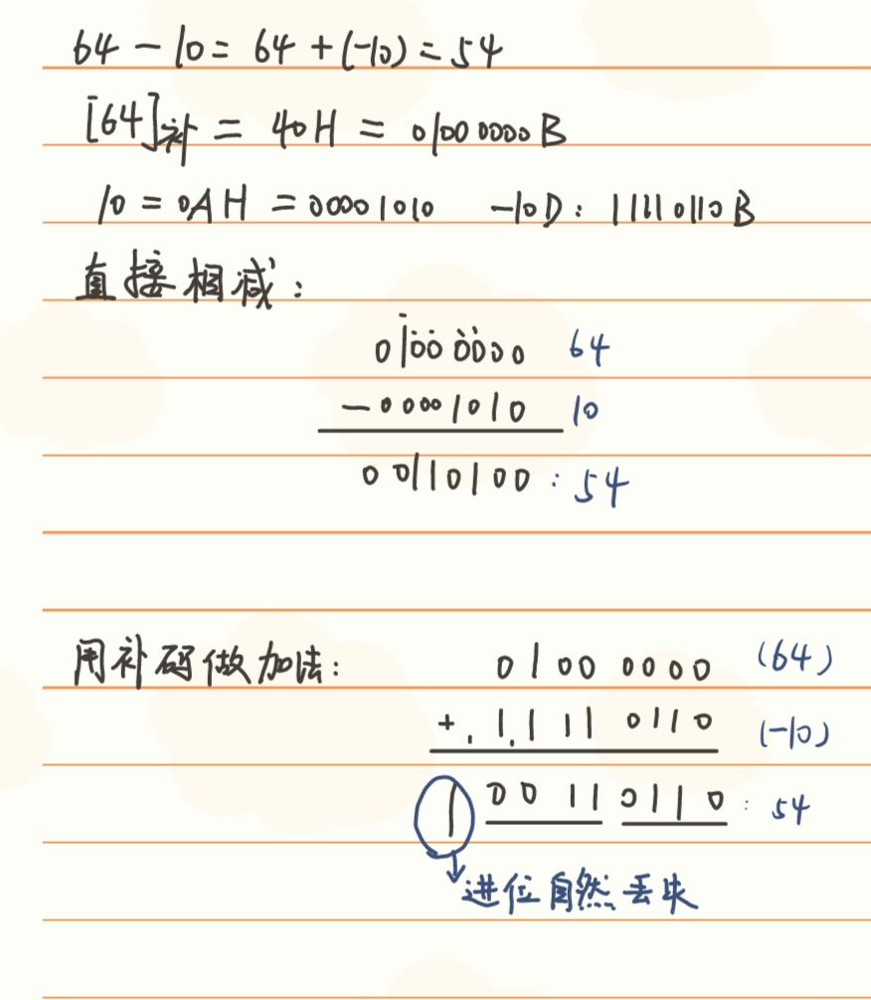
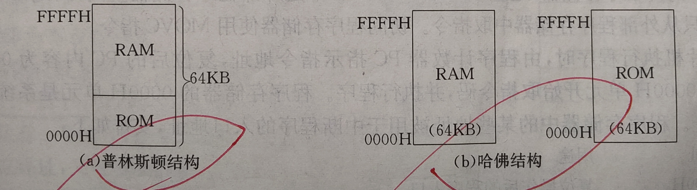
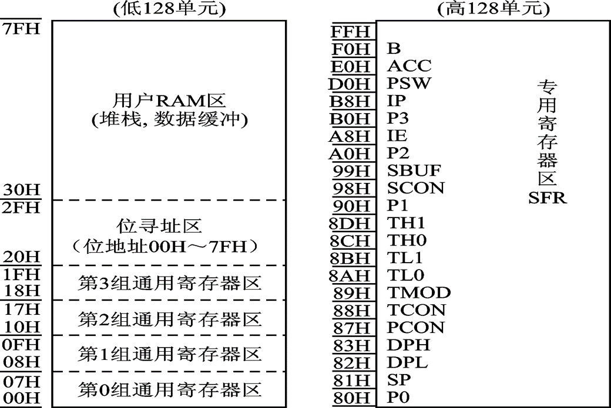
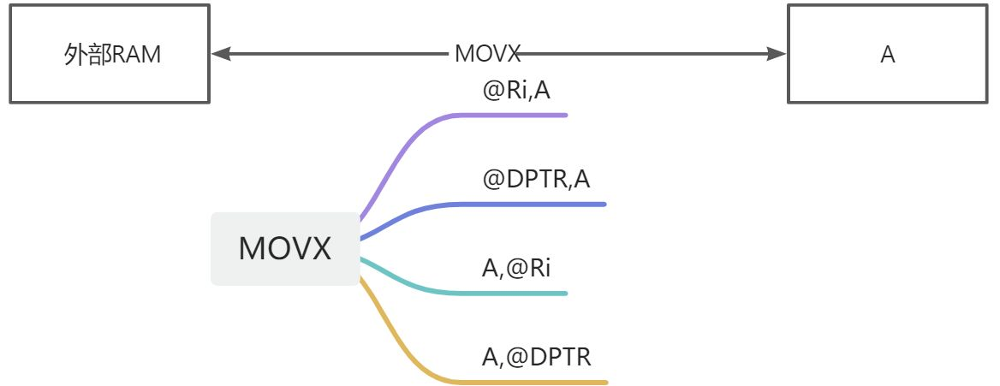
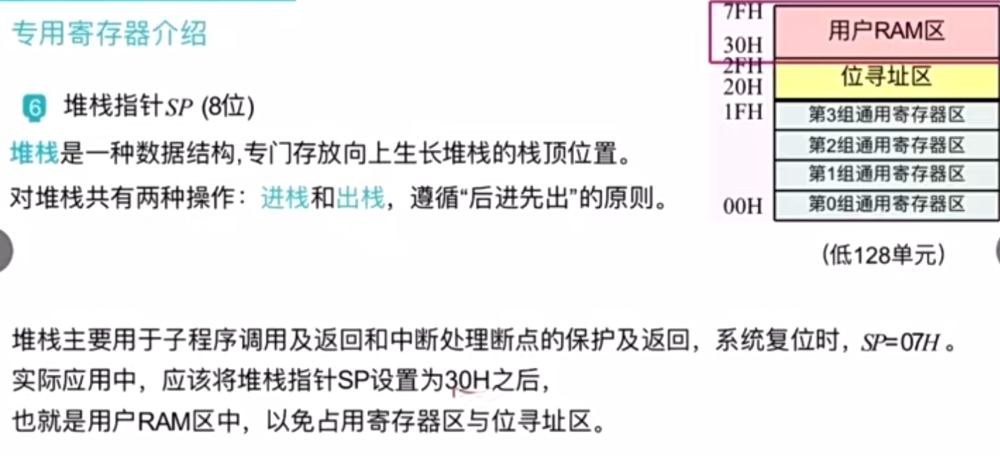
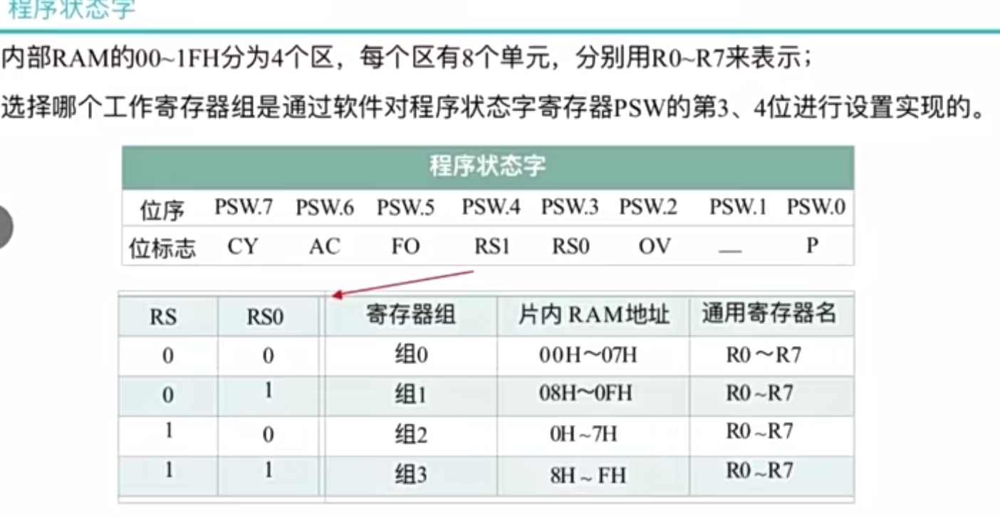
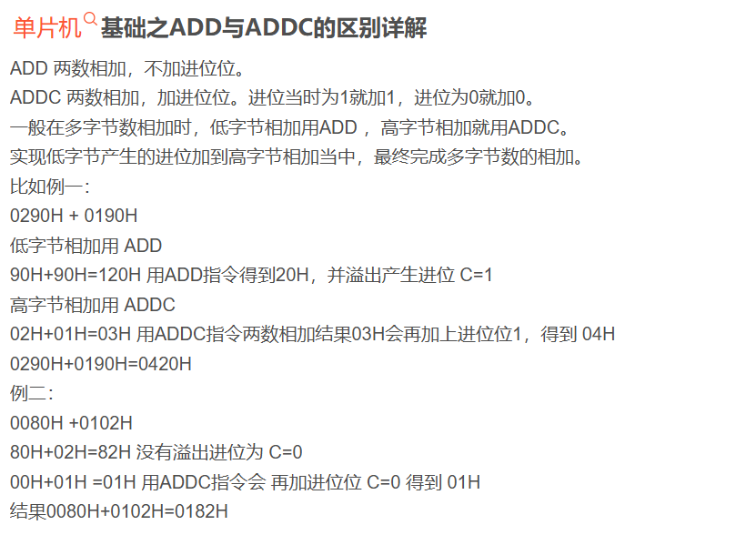
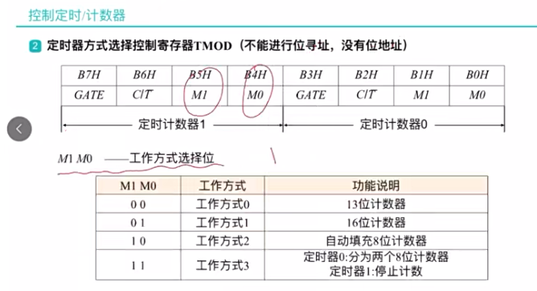

# 赞助支持
:::info
如果你觉得这个文档帮助到了你，你可以请作者喝杯咖啡表示鼓励 ☕️**（各位衣食父母可怜可怜孩子）**
:::

世界很暗，我也没有光。

# 绪论，单片机基础知识

## 什么是单片机？
全称：单片微型计算机(Single-Chip Microcomputer)，又称微控制器（MCU）
将计算机的基本部分微型化,使之集成在一块芯片上的微机。片内含有CPU、ROM、RAM、并行I/0、串行I/O、定时器/计数器、中断控制、系统时钟及系统总线等，它本身就是一个嵌入式系统。

## 原码反码补码
计算机中，凡是符号数一律用补码表示。两数相减是化归为补码的加法完成的。
减法借位标志与补码加法的进位标志之间为互反关系。
机器数的位数通常为8的整数倍

### 原码

### 反码

### 补码

### 补码的加减运算

# 绪论，单片机基础知识

## 什么是单片机？
全称：单片微型计算机(Single-Chip Microcomputer)，又称微控制器（MCU）
将计算机的基本部分微型化,使之集成在一块芯片上的微机。片内含有CPU、ROM、RAM、并行I/0、串行I/O、定时器/计数器、中断控制、系统时钟及系统总线等，它本身就是一个嵌入式系统。

## 原码反码补码
计算机中，凡是符号数一律用补码表示。两数相减是化归为补码的加法完成的。
减法借位标志与补码加法的进位标志之间为互反关系。
机器数的位数通常为8的整数倍

### 原码

### 反码

### 补码

### 补码的加减运算

- 补码运算之后结果仍为补码
- 用补码相加完成两数相减的运算，
   - 如果相加发生进位，则相减时不会产生借位。
   - 如果相加不发生进位，则相减会产生借位。

## 溢出标志和进位标志

## BCD码与压缩的BCD码

# 第一章 51单片机结构

## 普林斯顿结构和哈佛结构
80C51采用的是哈佛架构

## 片内 RAM 的分配
单片机的内部存储器包括数据存储器和程序存储器。80C51的数据存储区共有256个单元，按功能又划分为:低128单元区和高128单元区。
人话：内部的RAM分为低128位和高128位。结构如下图所示：

补：外部的RAM和I/O端口统一编址，使用指令`MOVX`访问，只能通过寄存器A访问。

## 特殊功能寄存器

## 程序状态字 PSW
CY：进位借位标志位，加法为进位，减法为借位。
AC：**低半字节**向**高半字节**进、借位的标志位。
RS1 RS0：如下图，选择哪一组通用寄存器

OV：溢出标志位，由CY和CY-1两者异或决定。
P：累加器A中“1”的个数的奇偶性。奇数为1，偶数为0。

## 晶振周期、机器周期和指令周期

# 第二章

## 指令的寻址方式

## 指令系统

## 算术运算和逻辑运算指令对 PSW 的影响

## DA 指令

## 控制转移指令

# 第六章 中断系统

## 中断处理的过程

## 51 单片机的中断源和中断系统

## 中断服务程序的编写

# 第七章 定时计数器

# 第八章 单片机的串行接口

## 并行通信和串行通信的概念

## 异步通信和同步通信的概念

## 3 种通信线路形式

## 串行口的编程

