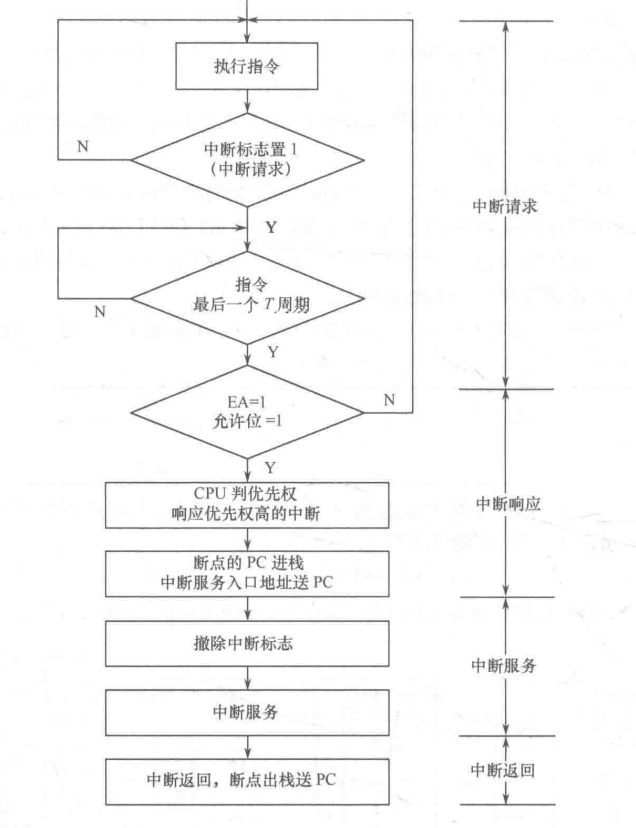

# 绪论，单片机基础知识

## 什么是单片机？
全称：单片微型计算机(Single-Chip Microcomputer)，又称微控制器（MCU）
将计算机的基本部分微型化,使之集成在一块芯片上的微机。片内含有CPU、ROM、RAM、并行I/0、串行I/O、定时器/计数器、中断控制、系统时钟及系统总线等，它本身就是一个嵌入式系统。

## 原码反码补码
计算机中，凡是符号数一律用补码表示。两数相减是化归为补码的加法完成的。
减法借位标志与补码加法的进位标志之间为互反关系。
机器数的位数通常为8的整数倍

### 原码


### 反码


### 补码


### 补码的加减运算


- 补码运算之后结果仍为补码
- 用补码相加完成两数相减的运算，
   - 如果相加发生进位，则相减时不会产生借位。
   - 如果相加不发生进位，则相减会产生借位。

## 溢出标志和进位标志


## BCD码与压缩的BCD码


# 第一章 51单片机结构

## 普林斯顿结构和哈佛结构
80C51采用的是哈佛架构


## 片内 RAM 的分配
单片机的内部存储器包括数据存储器和程序存储器。80C51的数据存储区共有256个单元，按功能又划分为:低128单元区和高128单元区。
人话：内部的RAM分为低128位和高128位。结构如下图所示：


补：外部的RAM和I/O端口统一编址，使用指令`MOVX`访问，只能通过寄存器A访问。


## 特殊功能寄存器


## 程序状态字 PSW
CY：进位借位标志位，加法为进位，减法为借位。
AC：**低半字节**向**高半字节**进、借位的标志位。
RS1 RS0：如下图，选择哪一组通用寄存器

OV：溢出标志位，由CY和CY-1两者异或决定。
P：累加器A中“1”的个数的奇偶性。奇数为1，偶数为0。

**复位时：**
**A:00H**
**PSW: 00H**
**SP:07H**
**P0~P3:FFH**

## 晶振周期、机器周期和指令周期
fosc：晶振频率

1. 振荡周期（时钟周期）：晶振频率倒数
2. 机器周期MC（）：12个振荡周期组成
3. 指令周期：1~4个机器周期

# 第二章
51单片机的指令格式：操作符 目的操作数 ,源操作数 ;注释 

## 指令的寻址方式

### 立即寻址
直接给出操作数的方式
```
MOV A,#80
MOV DPTR,#0000
```

### 直接寻址

1. 内部的RAM中，地址直接给出
```
MOV A,25H ;25H为直接寻址
```

2. 特殊功能寄存器SFR，也是直接寻址
```
MOV P0,#45H; P0地址为80H，指令等价于
MOV 80H,#45H
```

### 寄存器寻址
通用寄存器（A,B,DPTR,R0~R7）的寻址方式
```
MOV A,R0
PUSH ACC
ADD A,ACC;A为寄存器寻址，ACC为直接寻址。因为指令格式为：ADD A,dir
```

### 寄存器间接寻址
寄存器中的内容为地址。这里的寄存器只能为：`R0``R1` `DPTR`，在前面添加`@`表示
对片内RAM：MOV 
对片外RAM：MOVX
```
MOV @R0,A
MOVX A,@R1
MOVX @DPTR,A
```

### 变址寻址
只能对ROM进行寻址，只能读不能写。
由`DPTR`或者`PC`中的内容加上A，在ROM中进行寻址
```
MOVC A,@A+DPTR
MOVC A,@A+PC
```

### 相对寻址

### 位寻址

## 指令系统


## 算术运算和逻辑运算指令对 PSW 的影响


## DA 指令


## 控制转移指令


# 第五章

## 为何 CPU 与 I/O 外设之间需要 I/O 接口 
**为了不产生总线冲突，以及快速的CPU和慢速外设时间上的协调**


## CPU 与 I/O 外设之间交换三类信息
数据、 状态和控制


## 为什么说C51中全部作为I/O口使用的仅有P1口
P0口的低8位可以常作为地址/数据总线口
P2口一般只作为地址总线使用
P3为双功能口

# 第六章 中断系统

## 中断处理的过程
中断请求
中断响应
中断服务
中断返回


## 51 单片机的中断源和中断系统


## 中断服务程序的编写


# 第七章 定时计数器


查询方式
先设置TMOD
再送入初值
启动TRx
JBC查看TF1是不是溢出，溢出时清零跳转

中断方式
先设置TMOD，选择定时器是方式几
启动定时器工作`TRx`
允许定时器中断`ETx`
开总中断`EA`


# 第八章 单片机的串行接口

## 并行通信和串行通信的概念
**并行通信**中传输的数据的各位**同时发送或同时接受**
**串行通信**中传输的数据的各位**按顺序一位一位的发送或接受**


## 异步通信和同步通信的概念


## 3 种通信线路形式


## 串行口的编程


# 第九章

## 系统扩展
片选法
线选法


## 存储器扩展


## IO扩展


# 第十二章

## ~~嵌入式系统的一般开发步骤~~
~~分析课题要求~~
~~确定方案~~
~~软硬件设计~~
~~软硬件联调及纠错~~
~~绘制印制电路板~~
~~焊接形成产品~~~~ ~~

## ~~嵌入式应用系统的设计原则~~

1. ~~选择单片机机型；~~
2. ~~充分利用 MCU 的片内硬件资源，简化系统扩展，提高可靠性； ~~
3. ~~了解服务对象特性，进行一体化设计，在性能指标上留有余地；~~
4. ~~在满足功能和性能要求的前提下，控制成本，提高性价比； ~~
5. ~~软件采用模块设计、便于编写、测试、调试、移植及维护； ~~
6. ~~考虑应用系统的使用环境，采取相应措施，如抗干扰等。~~~~ ~~

## 嵌入式系统的开发工具 
PC、 编程器和仿真机 


## 嵌入式系统的开发有两种方法 
PC+模拟仿真器+编程器
PC+在线仿真器+编程器


## ~~嵌入式系统的抗干扰技术~~
~~硬件抗干扰~~
~~软件抗干扰：重点是看门狗~~
