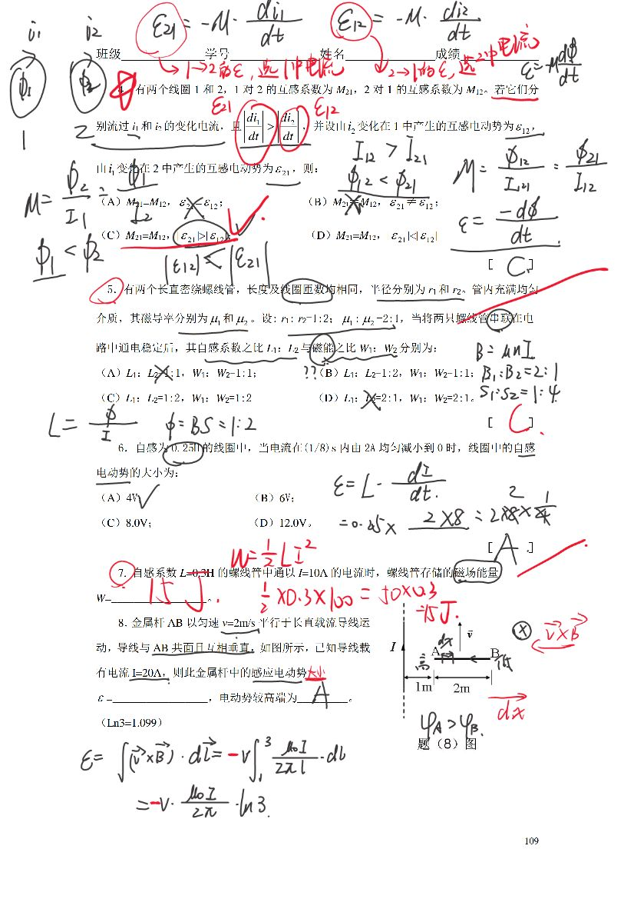
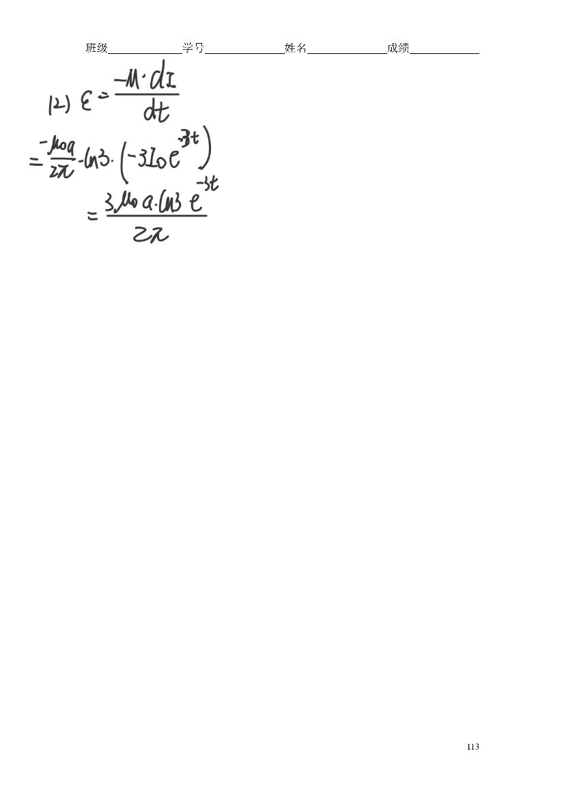
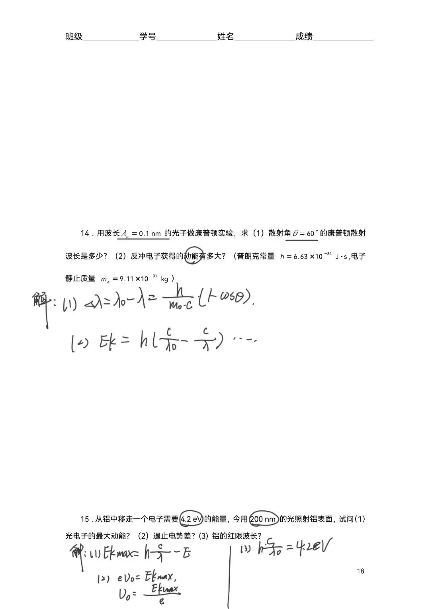

# 可参考资料

## 上课PPT（我从来没有看过）
[第十六章 量子物理1.pptx](https://www.yuque.com/attachments/yuque/0/2023/pptx/34023817/1678631283277-4f4f27b3-6c27-417a-a1d5-3fa417d5aaec.pptx)
[第十三章 波动.pptx](https://www.yuque.com/attachments/yuque/0/2023/pptx/34023817/1678631272060-97434d3d-b180-44eb-90a6-cec256e7d598.pptx)
[第十四章 波动光学-光的干涉.pptx](https://www.yuque.com/attachments/yuque/0/2023/pptx/34023817/1678631277295-f858c6e8-b0fe-46f1-a9a0-6258212aaa1b.pptx)
[第十四章 波动光学-光的衍射(1).pptx](https://www.yuque.com/attachments/yuque/0/2023/pptx/34023817/1678631282393-d80f84d3-909b-4187-b9fd-8a42006fc54d.pptx)

## 作业原稿PDF
[练习十三-十七.doc](https://www.yuque.com/attachments/yuque/0/2023/doc/34023817/1678631631858-e74e3243-6720-46f9-a5ed-ea47ae5eeba7.doc)

[练习七八九十.pdf](https://www.yuque.com/attachments/yuque/0/2023/pdf/34023817/1678631632206-faf16ab0-f2cb-4120-bfd3-26c0f97c018e.pdf)

[练习十一十二.pdf](https://www.yuque.com/attachments/yuque/0/2023/pdf/34023817/1678631631945-e6037c50-e0c1-4e1c-83c3-d4370aea392f.pdf)

## 作业标准答案
[练习十二解答.pdf](https://www.yuque.com/attachments/yuque/0/2023/pdf/34023817/1678631765747-42ded339-1552-46c7-9820-b032d5d644cb.pdf)
[练习十解答.pdf](https://www.yuque.com/attachments/yuque/0/2023/pdf/34023817/1678631765698-feacf240-6be5-41cf-9c07-e2d5935bd4ce.pdf)
[练习十七解答.pdf](https://www.yuque.com/attachments/yuque/0/2023/pdf/34023817/1678631765539-6e65faab-81da-42fa-b8b1-ac6b0543b07c.pdf)
[练习十三解答.pdf](https://www.yuque.com/attachments/yuque/0/2023/pdf/34023817/1678631765742-cee63be7-cae7-43e4-ab8a-36ef7f726628.pdf)
[练习十四解答.pdf](https://www.yuque.com/attachments/yuque/0/2023/pdf/34023817/1678631765686-b99e0bc8-0553-4cf3-9c4b-f19295cb0cee.pdf)
[练习十一解答.pdf](https://www.yuque.com/attachments/yuque/0/2023/pdf/34023817/1678631766278-bcd806d7-d674-4289-b947-6229006fd321.pdf)
[练习十五解答.pdf](https://www.yuque.com/attachments/yuque/0/2023/pdf/34023817/1678631765940-b95a1aa8-5d74-4c7a-9937-01e028aeb2fc.pdf)

# 作者笔记
[振动与波动.pdf](https://www.yuque.com/attachments/yuque/0/2023/pdf/34023817/1677118462995-2f716bfd-f2a0-4fc8-8647-2e1ebe3aeea2.pdf)
[电磁感应(1).pdf](https://www.yuque.com/attachments/yuque/0/2023/pdf/34023817/1677118477729-ba0d0dde-0b7a-4ee4-a939-4fcedf8ef29f.pdf)
[光学.pdf](https://www.yuque.com/attachments/yuque/0/2023/pdf/34023817/1677154454665-b37a2e08-4583-4145-bea2-cc73f54f7760.pdf)

# 作业手稿：

## 电磁感应作业：

关于动生电动势的方向问题：

根据公式：仅仅只是求出了感应电动势的大小和方向、并不表示这就是电势差的方向。
求解电势差时还需要根据右手定则仔细判断，哪边高，哪边低。

## 振动与波动作业：

## 量子物理作业：

## 光学作业：

