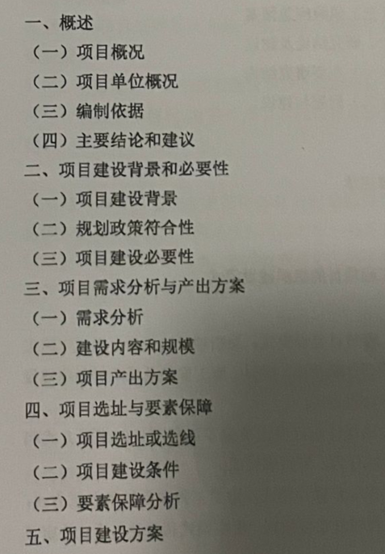
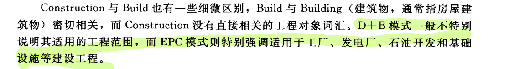

参考书PDF：
[工程项目管理 -- 孙剑主编 -- 2011 -- 北京：中国水利水电出版社 -- 9787508483221 -- b85ea16c91ac9114a1d8e77b8594a4f6 -- Anna’s Archive.pdf](https://www.yuque.com/attachments/yuque/0/2024/pdf/34023817/1719240801666-c2d7e4ea-05e9-4dea-9483-152e2585266f.pdf)

# 第一章 概述

## 项目的定义
所谓项目就是指在一定约束条件下（主要是限定资源、限定时间、限定质量)，具有
特定目标的一次性任务

## 项目的类型和特征
类型：

特征：

- 一次性和独特性
- 有明确的目标

## 项目的生命周期

- 概念阶段
- 规划设计阶段
- 实施阶段
- 结束阶段

## 项目管理的内容
项目范围管理
项目进度管理
项目成本管理
项目采购及合同管理
项目综合管理
项目质量管理
项目沟通管理
项目风险管理
项目人力资源管理

## 项目管理的过程

## 工程项目管理的基本原理
系统原理
计划原理
组织原理
控制模式

## 工程项目的特点：

1. 可交付成果的固定性
2. 建设周期的长期性
3. 工程项目投资的风险性
4. 工程项目管理的复杂性

# 第二章 工程项目的前期策划

## 工程项目的策划是什么？
**工程项目策划是指从项目构思产生到项目正式批准立项这一过程中对项目所进行的全面策划**
前期策划的过程和主要工作：

1. 工程项目构思的产生和选择
2. 项目的目标设计和项目定义
3. 项目建议书
4. 可行性研究

## 可行性研究
（会编就行）

# 第三章 工程项目组织

## 建设模式

1. 传统模式（DBB）：按照**设计、招标、建造**的顺序执行，一个阶段结束之后另一个再开始
2. 项目总承包模式：
   1. 设计建造模式（DB模式）
   2. EPC模式
:::info
简答题：DB和EPC的共同点和区别。

:::

3. CM模式

CM模式对于工期紧迫、项目范围和规模不确定、设计变更可能性较大、技术复杂的建设工程更能体现出其优势。

4. 管理承包模式PMC
5. BOT模式（建造——运营——移交）

## 工程项目管理组织（简答）

### 直线组织形式

### 职能式组织形式
优点：
设置了职能部门，有利于提高管理效率，减轻项目经理的负担
缺点：
由于存在多个指令源，出现矛盾时工作部门会无所适从，容易相互推诿

### 项目式组织形式

### 矩阵式组织形式

## 项目团队的发展阶段

# 第四章 网络计划技术

## 网络图的绘制

### 双代号网络图的绘制
这个PPT也是不说人话……

【例】

【例】

### 单代号网络图的绘制
当网络图中同时有多项工作开始时，应增设一项虚拟的工作（START），作为该网络图的起点节点；
当网络图中同时有多项工作结束时，应增设一项虚拟的工作（FIN），作为该网络图的终点节点

## 时间参数的计算

### 双代号网络计划时间参数计算

#### 按工作计算法

1. 先从左向右算出每个工作的最早开始时间和最早完成时间，出现多个紧前工作时，找最大值。
2. 再从右向左算出每个工作的最迟开始时间和最迟完成时间，出现多个紧后工作时，找最小值
3. 计算总时差
4. 计算自由时差
5. **总时差为0的工作为关键工作**

#### 按节点计算法

#### 标号法

### 单代号网络计划时间参数计算

1. 先计算出`ES`和`EF`

2. 计算`LAG`

3. 计算`TF`

4. 计算`FF`

5. 计算`LS`和`LF`

# 第五章 工程项目计划

## 范围管理是什么
划定哪些方面是属于项目应该做的，而哪些方面是不应该包括在项目之内的

## 范围管理有哪些管理内容
产品的范围、项目的范围

## 工作分解结构 WBS（简答）
简答题：WBS的作用

- 保证项目结构的系统性和完整性
- 通过项目结构分解，使项目的组成结构明确、清晰，项目形象更加透明，一目了然。
- 用于建立目标保证体系
- 是进行目标分解，建立项目组织，落实组织责任的依据
- **是进行工程项目网络计划技术分析的基础**
- 工作分解结构的各个项目单元是工程项目报告系统的对象，**是项目信息的载体**

## 工程项目进度计划
表示方法：甘特图 网络图

# 第六章 工程项目实施控制

## 进度控制
前锋线的画法

## 项目费用控制
选择题
连环替代法、挣值法、比率法

## 项目的质量控制
选择题
基本原理：PDCA，即计划（plan）、执行（do）、检查（check）、处理（action）

## 统计方法
选择题
• 排列图（主次因素排列图）
• 因果分析图
• 频数分布直方图（波动频数）
• 控制图（动态控制）

---

这是前年的重点：

# 简答题：
1、工程项目的特点
2、工程项目的投资决策（内容）2-3章
3、工作分解结构WBS
4、项目的质量、质量目标
5、项目的建设模式，BOT
6、项目的组织结构
