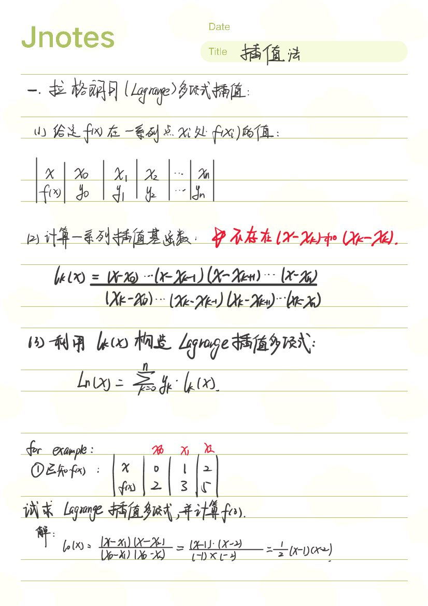
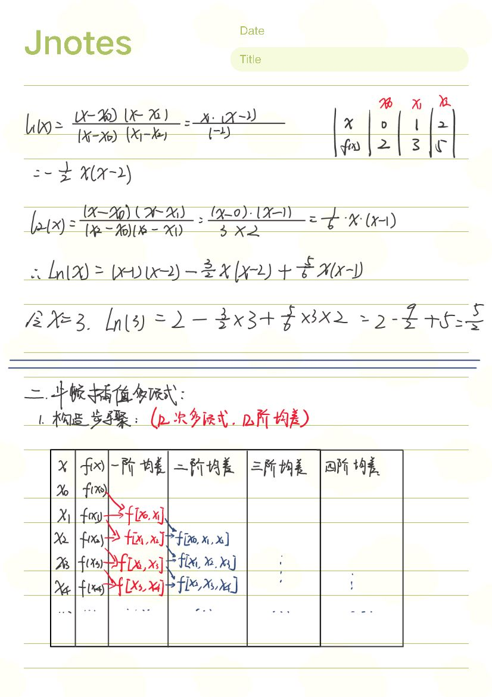
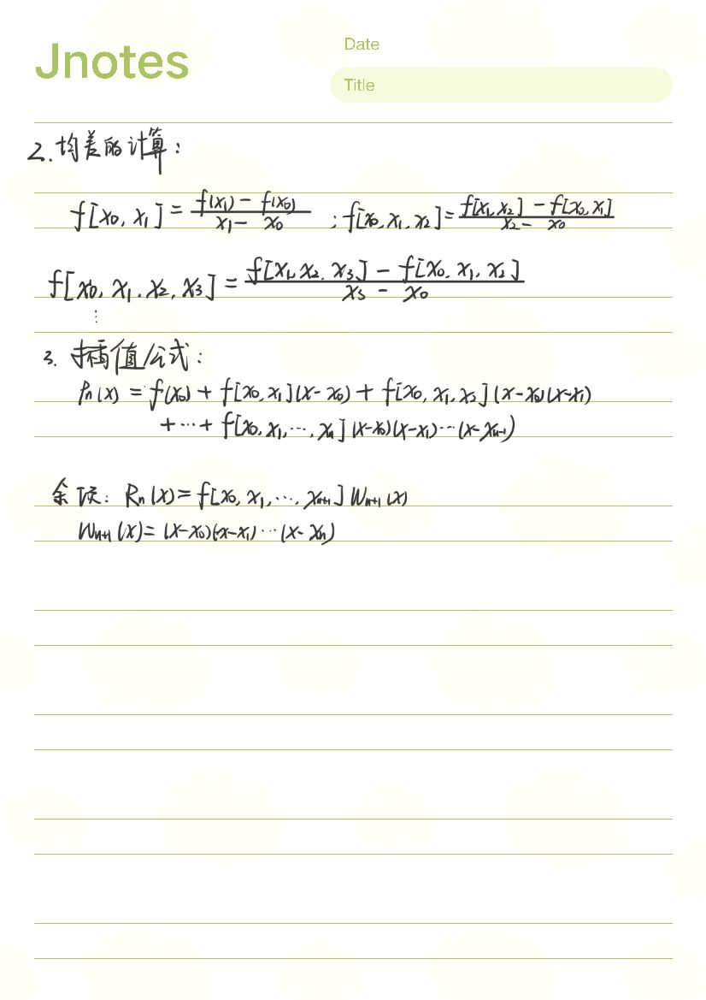

复习资料
[2022计算方法复习.pdf](https://www.yuque.com/attachments/yuque/0/2023/pdf/34023817/1683294517964-c65d4074-0f17-473a-98bb-23de4db5eb70.pdf)

[2020计算方法试卷A.pdf](https://www.yuque.com/attachments/yuque/0/2023/pdf/34023817/1682662727712-67541062-2e4b-4cf0-b30b-10f5bbf8c27e.pdf)

# 误差与有效数字

# 非线性方程组的解法

# 线性方程组的解法

# 插值法

# 曲线拟合

# 数值积分

# 常微分方程的初值问题
