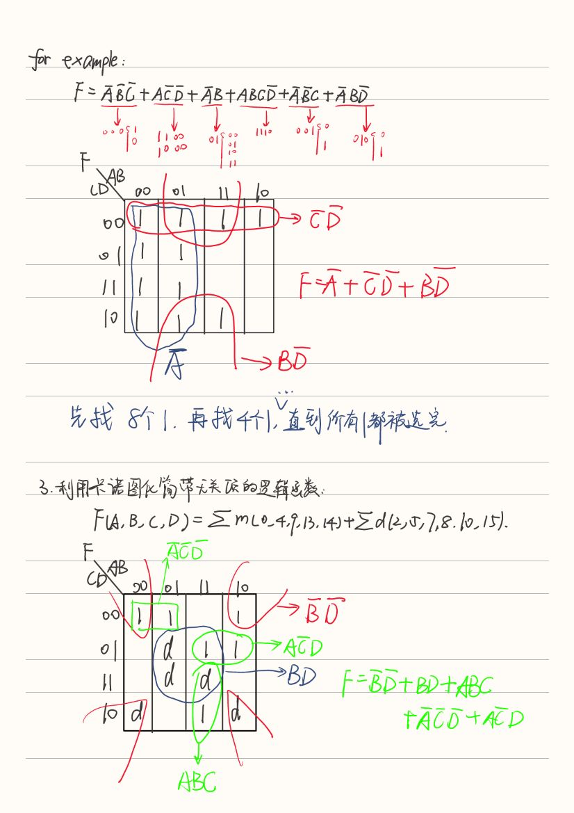
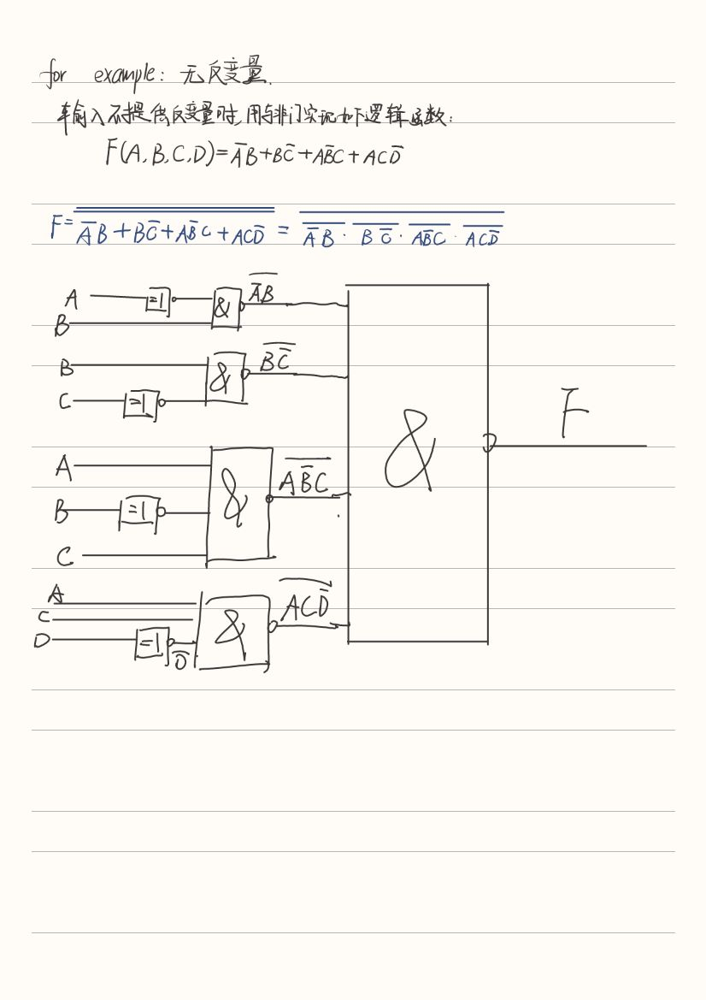

# 参考资料：
[绪言.ppt](https://www.yuque.com/attachments/yuque/0/2023/ppt/34023817/1683029488210-b4bff7c5-41fa-4295-9044-8474377ce37e.ppt)
[第一章.ppt](https://www.yuque.com/attachments/yuque/0/2023/ppt/34023817/1683029488331-c32186a6-3db8-422d-9546-87c7ed4f4db5.ppt)
[kejian-02.ppt](https://www.yuque.com/attachments/yuque/0/2023/ppt/34023817/1683029487737-504bc4cc-2e57-4b97-bdb7-08f9e59a67b0.ppt)
[kejian-03.ppt](https://www.yuque.com/attachments/yuque/0/2023/ppt/34023817/1683029487502-bf5c2bbe-bf67-409d-afb4-0c69d4df4750.ppt)
[kejian-04.ppt](https://www.yuque.com/attachments/yuque/0/2023/ppt/34023817/1683029487299-75006f0a-f03a-4d10-ad92-ab2be6160ee5.ppt)
[kejian-05.ppt](https://www.yuque.com/attachments/yuque/0/2023/ppt/34023817/1683029487662-470c875c-8709-4384-ba21-d2ed28519adb.ppt)
[kejian-06.ppt](https://www.yuque.com/attachments/yuque/0/2023/ppt/34023817/1683029487349-4b0b2524-f12b-4ec1-a79d-93f292a3ce6d.ppt)
[kejian-07.ppt](https://www.yuque.com/attachments/yuque/0/2023/ppt/34023817/1683029488738-a9149033-4d20-4238-947d-1659b5b14d13.ppt)
[kejian-08.ppt](https://www.yuque.com/attachments/yuque/0/2023/ppt/34023817/1683029488142-2bb0041e-d5df-4d5b-a9dd-b6f22f37aa02.ppt)

**_参考答案存在错误_**
[数字逻辑欧阳星明第四版华科出版1~7全答案(1).pdf](https://www.yuque.com/attachments/yuque/0/2023/pdf/34023817/1683029468445-5525d2ae-d46d-4e81-840c-c1a098d1f7ff.pdf)

# 知识点整理：

## 进制转换与源码、反码、补码

## 逻辑代数与卡诺图

## 门电路与触发器

## 组合逻辑电路

## 同步时序逻辑电路

## 异步时序逻辑电路

## 中规模集成电路

