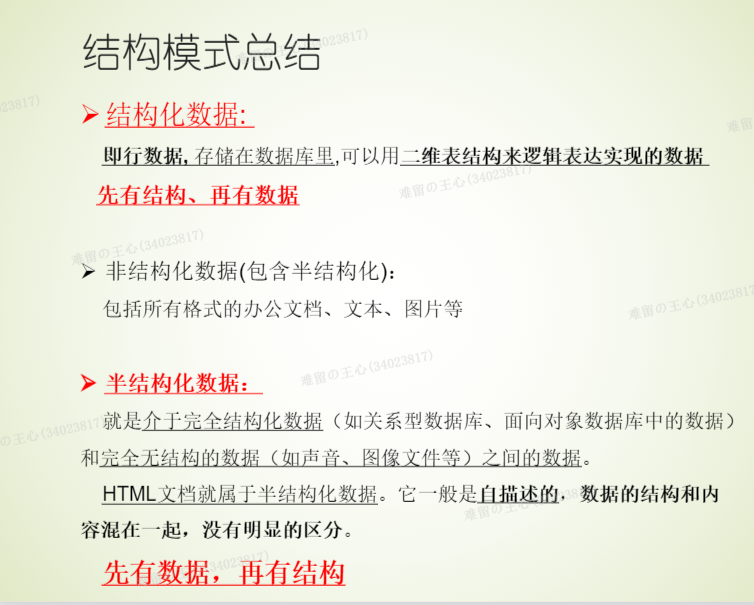
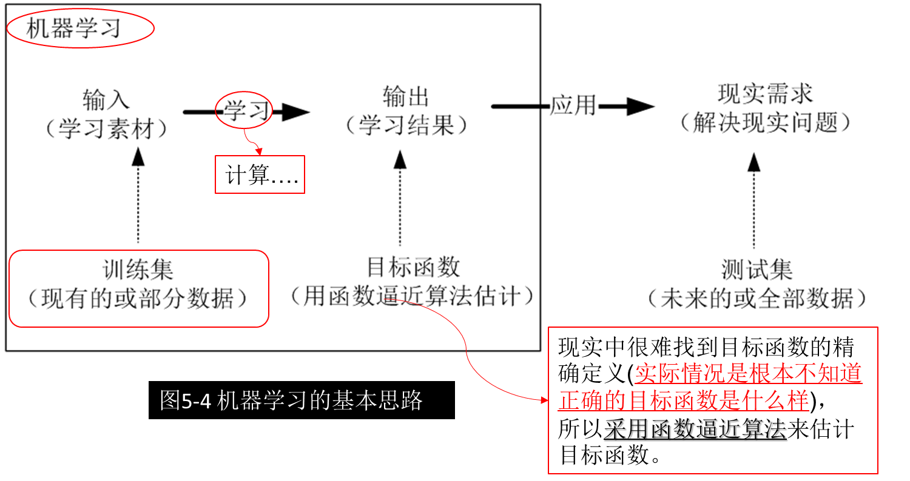
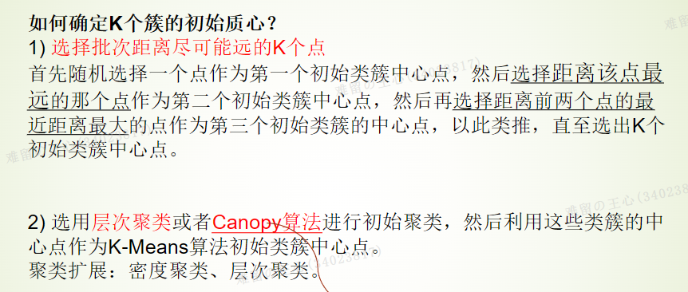
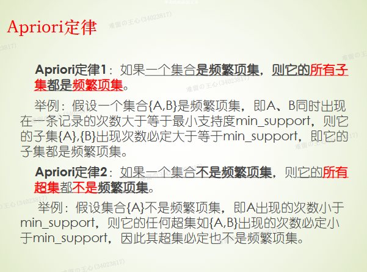
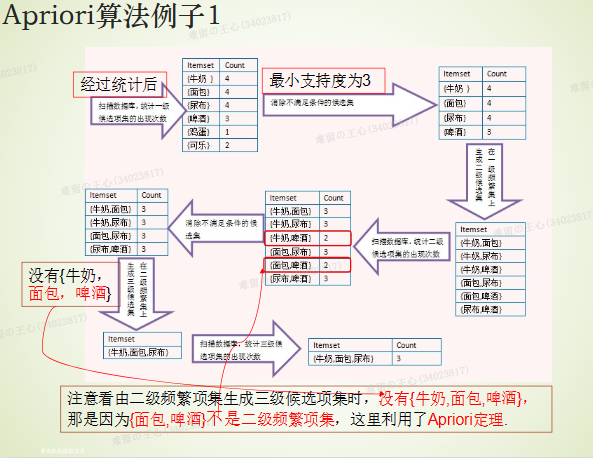
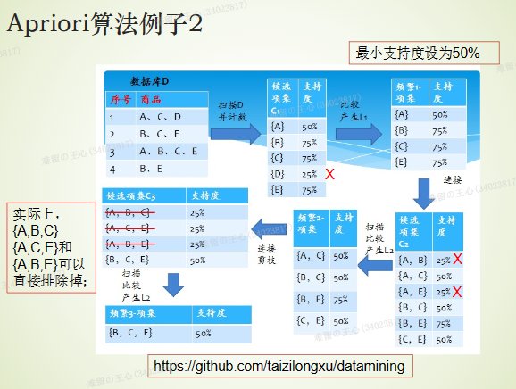
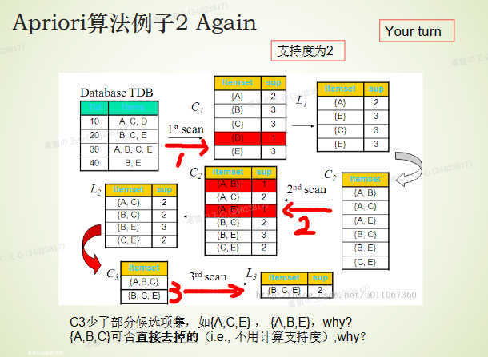

# 考试重点：
考试题型：选择题（30分）、简答题（25分）、设计题（30分）和实践设计题（15分）
数据的定义，数据科学含义，数据内涵的理解
数据质量定义，大数据特征，数据进行处理的2个动机
机器学习基本概念
哪种数据库是理想的缓冲层解决方案
NoSQL的定义，与关系数据库的对比
4种nosql数据库对应的有哪些具体的数据库 
BP算法缺点。数据脱敏概念和原则
ETL概念和为何需要ETL
探索性分析（EDA）描述内容/基于实例的学习方法描述内容
键-值数据库/文档数据库/图形数据库的描述
爬虫行为有哪些
结构化数据、非结构化数据与半结构化数据的区别与联系
关系型数据库的描述（与NoSQL数据库对比）
随机变量的典型分布方式
噪声数据处理的方法
人工神经网络的描述，连接方式，组成，感知器
人工神经网络的内容和神经网络有哪些学习算法，适合解决哪些问题
机器学习中目标函数的选择/机器学习中训练经验的选择需要注意哪些问题

做数据预测的方法
k-近邻算法和k-Means算法
强化学习Q-learning方法的例子计算
线性规划建模例子
Chap4中的Apriori算法例子1和例子2
 

开放题（实践设计题）

[复习题纲.docx](https://www.yuque.com/attachments/yuque/0/2023/docx/34023817/1687052200601-7d1dbcd4-63d2-405f-9906-de82aab93a33.docx)

# 上课PPT：
[Chap1 基础理论.pptx](https://www.yuque.com/attachments/yuque/0/2023/pptx/34023817/1686801260817-1eaac598-5225-4874-bc58-3f95d85602ed.pptx)

[Chap2 数据预准备&数据模型.pptx](https://www.yuque.com/attachments/yuque/0/2023/pptx/34023817/1686801256822-6c5a12be-132e-4b56-9b39-3ab12bc8f1cb.pptx)

[Chap3 数据预处理.pptx](https://www.yuque.com/attachments/yuque/0/2023/pptx/34023817/1686801241077-9dc07695-32be-42a7-993c-127b4c1a25b3.pptx)

[Chap4 数据统计.pptx](https://www.yuque.com/attachments/yuque/0/2023/pptx/34023817/1686801240885-2a8bedb7-f1f8-44dd-a210-2c1bf0b55ff0.pptx)

[Chap5 机器学习  -精简版.pptx](https://www.yuque.com/attachments/yuque/0/2023/pptx/34023817/1686801241147-41174f37-4789-43cf-8718-8c818dacc85c.pptx)

[Chap6.1 数据计算.pptx](https://www.yuque.com/attachments/yuque/0/2023/pptx/34023817/1686801254870-699fd8cd-c4e5-4ed5-969e-38f2eb059409.pptx)

[Chap6.2 Spark简介.pptx](https://www.yuque.com/attachments/yuque/0/2023/pptx/34023817/1686801255404-18d8f6cf-5c92-4cac-abb1-95738827737d.pptx)

[chap6.3 Hadoop系统体系结构 - Hive.pptx](https://www.yuque.com/attachments/yuque/0/2023/pptx/34023817/1686801255937-58ace4f2-5d41-4972-a4bd-e90a5729eaa8.pptx)

[Chap9 推荐系统.ppt](https://www.yuque.com/attachments/yuque/0/2023/ppt/34023817/1686801239817-44a8a170-a6b9-469c-852b-470c89256bee.ppt)

# 选择题：
:::warning
属于数据的是：以上都是
数据和智能描述错误：数据直接产生人工智能
大数据电脑特征：价值密度低
大数据时代新理念：以上都正确
数据科学含义：以上都正确
NoSQL :Not Only SQL
数据库理想缓冲层：键值
列族数据库：以上都对
不属于列族数据库：Redis
文档数据库描述正确的是：以上都正确
Neo4J:图形数据库
图形数据库描述错误的是：大规模数据
探索性分析EDA错误的是：验证在前，探索在后
机器学习训练经验的选择需要注意哪些问题 描述错误的是：训练集是否可以随机抽取
基于实例学习的学习方法描述错误：分类新实例开销小
基于实例的学习方法：K-近邻 局部
人工神经网络描述错误：线性单元是最简单的“人工神经元”
哪个是人工神经网络的学习算法：梯度下降 反向传播 BP  ** Apriori算法不是（数据挖掘算法）**
BP缺点：以上都是
增强（强化）学习描述错误:回报随着延迟指数增加（不考）
K-近邻：分类 K-means：聚类
大数据计算平台组件描述错误：Pig的核心是机器学习算法及实现的核心
基于人口统计学的推荐机制：系统用户的基本信息
数据理解错误的是：不会带来负面影响
大数据与常规数据描述正确的是：以上都正确
不是爬虫行为的是：压缩（载入、解析、存储，载入是最复杂的）
关系型数据库说法错误的是：大数据时代得力的存储工具
Neo4J特点说法错误的是：基于C#（Java）的开源图形数据库
不是数据质量属性：大小
统计学规律在数据质量检验中的应用：综合不同的技术方案进行
数据鉴别方法：都是
探索性和验证性数据分析的说法正确的是：探索性在前，验证性在后
不是数据审计方法：探索性审计
噪声数据：全是
不是连续性随机变量：泊松分布
基于实例的学习方法有时也称为：消极学习法
决策树学习特点错误的是：使用前提较为宽松
人工神经网络连接方式不包括：转化层
:::

# 简答题：

## 结构化数据、非结构化数据与半结构化数据的区别与联系？？

## 数据科学基本流程：

## **对于大数据而言，传统关系型数据库有什么问题？为什么？**
无法满足海量数据的管理需求
无法满足高并发的需求
没有高扩展性和高可用性

## **NoSQL数据库有哪些类型？请解释其中的一种**

-  键值数据库：Redis、Riak、SimpleDB、Chordless、Scalaris

- 列族数据库：HBase、BigTable、PNUTS、HadoopDB、Cassandra

- 文档数据库：MongoDB、CouchDB、Terrastore、CloudKit、RavenDB

- 图数据库：Neo4J、GraphDB、OrientDB、InfoGrid、Infinite Graph

## **ETL是什么？为什么需要ETL？（很重要）**
:::info
提取，转换，加载。
为什么需要?
ETL负责将分散的、异构数据源中的数据，如关系数据、平面数据文件等，抽取到临时中间层后，进行清洗、转换、集成，最后加载到数据仓库或数据集市中，成为联机分析处理、数据挖掘提供决策支持的数据。
用户从数据源抽取所需的数据，经过**数据清洗**，最终按照预先定义好的**数据仓库模型**，**将数据加载到数据仓库中**
:::

## 噪声数据有哪些方法？请至少给出两种方法的解释
•    分箱（Binning）：把数据集放入多个箱内，用箱子的均值替换该箱内部的每个数据成员，从而达到降噪目的。
•    聚类（Clustering）：通过聚类检测离群点，将类似的值组织成群或簇。直观地，落在簇集合之外的值视为离群点。
•    回归（Regression）：用一个函数（如回归函数）拟合数据来光滑数据。

## 什么是数据脱敏？实现数据脱敏的原则是什么？
:::info
概念：保护主体的信息安全隐患和个人隐私风险
原则：
•    **单向性：从原始数据可以容易得到脱敏数据，但无法从脱敏数据推导出原始数据。**
•    **无残留: 保证用户无法通过其他途径还原敏感信息。**
•    **易于实现:数据脱敏涉及的数据量大,需要简单的计算方法。如不能采用加密算法来进行脱敏，则计算太复杂。**
:::

## K-means聚类算法中，如何确定k个簇的初始质心
> •        第1步，在原始数据集中**任意选择 k 个对象**作为“**初始聚类中心对象**”；
> •        第2步，计算其他对象与这些初始聚类中心对象之间的距离，并根据最小距离，将其他结点合并入对应的最小聚类中心结点所在的聚类，形成k=2个“中间聚类结果”；
> •        第3步，计算**每个“中间聚类结果”的均值**，在k中间聚类中找出k=2个“**新的聚类中心对象**”；
> •        第4步，**重新计算**每个对象与这些“新的聚类中心对象”之间的距离，并根据最小距离，**重新分类**，形成k=2个“中间聚类结果”；
> •        第5步，重复执行步骤3~4。当**所有对象的聚类情况不再变化或已达到规定的循环次数时**，结束执行，并得到最重聚类结果。

## 随机变量的典型分布方式
离散型随机变量：二项分布和泊松分布
连续型随机变量：正态分布、卡方分布、t分布和f分布

## 什么是机器学习？实现的步骤是什么？（很重要）
如果一个计算机系统在完成某一类任务T的性能P能够随着经验E而改进，则称该系统在从经验E中学习，并将此系统成为一个学习系统

## 人工神经网络的BP算法
•        计算量超大
•        该学习算法的收敛速度慢
•        从数学角度看，B-P算法是一种梯度最速下降法，这就可能出现局部极小的问题。

## 人工神经网络适合解决哪些类别的问题？（2种类别）

- 实例是采用“属性-值”（实际上就是特征）对表示。

学习目标函数是定义在可以用向量描述的实例之上，向量由预先定义的特征组成。通常输入属性之间可以高度相关，也可以相互独立。注意，输入值可以是任何实数。

- 目标函数的输出可能是离散值、实数值或者由若干实数属性或离散属性组成的向量。

- 训练数据可能包含错误。

人工神经网络学习算法对训练数据中的错误具有较强的鲁棒性。

-  可容忍长时间的训练。

人工神经网络训练算法通常比像决策树学习算法需要更长时间的训练。

- 需要快速求出目标函数值（看似与上一点矛盾）。

尽管人工神经网络训练时候较长，但对于已经学习好的人工神经网络求值速度相对较快，可以直接应用于实例。
如自动驾驶系统ALVTNN，可以每秒应用神经网络多次，以不断更新驾驶方向。

- 不需要人类理解目标函数。

通常情况下，我们难以理解神经网络方法学习到的权值，而且难以直接理解所学到的神经网络。

## 什么是贝叶斯学习？本质

## 关系数据库和NoSQL的优缺点
**关系数据库**
**优势**：以**完善的关系代数理论作为基础，有严格的标准**，支持事务ACID四性，借助索引机制可以实现高效的查询，技术成熟，有专业公司的技术支持
**劣势**：**可扩展性较差**，**无法较好支持海量数据存储**，数据模型过于死板、无法较好支持大数据应用，事务机制影响了系统的整体性能等
**NoSQL数据库**
**优势**：可以**支持超大规模数据存储**，**灵活的数据模型**可以很好地支持Web2.0应用，具有强大的横向扩展能力等
**劣势**：**缺乏数学理论基础，复杂查询性能不高**，大都不能实现事务强一致性，很难实现数据完整性，技术尚不成熟，缺乏专业团队的技术支持，维护较困难等

## Qlearning例题必考

## 什么是数据预处理
数据审计
数据清洗
数据变换
数据集成
其他预处理

## 假设检验是什么？步骤

## K-means的质心如何确定

## Apriori例题

# 设计题：
（最后一题，推荐算法+大规模数据处理。）据说是拿chatGPT出的
通过把报纸的每页分别扫描为电子版图片，美国纽约时报实现了电子化所有的报纸文档。但是这些电子化的报纸并没有每份把报纸整合为一张完整的报纸。因为需要把这些报纸的电子版放到网上，所以需要对每份报纸进行整合(也就是需要把每份报纸对应的每页电子版图片合并为-张大图片，以便放到网上方便浏览)。但这些图片数量极其庞大(约有1500G)，单个计算机在短时间内无法完成该任务。请你设计一种计算模式能在较短的时间内完成该项报纸整合任务。
1)请给出你设计的计算模式或者已有的适合该任务的计算模式(也就是编程模型)以及该技术
的基本原理或结构。
2)在该计算模式下，请你给出报纸整合任务的步骤。

（1）
计算模式：分布式计算与并行处理
针对这个问题，我们可以采用分布式计算和并行处理的方法。分布式计算是指将一个大型问题分解成若干个较小的子问题，并将子问题分配给多个计算机节点进行处理。这些计算机节点能够协同工作，共同解决原问题。并行处理则是指在同一时间内，多个计算机节点对不同子问题进行处理，从而大大降低完成任务的时间。
基本原理或结构：
在分布式计算系统中，通常有一个主节点（Master Node）和多个工作节点（Worker Node）。主节点负责管理任务分配和结果收集，而工作节点则负责实际执行任务。这种模式可以充分利用硬件资源，实现任务的高效处理。MapReduce 和 Apache Spark 是两个广泛使用的分布式计算框架，可以用于处理大量数据。
(2)
报纸整合任务的步骤：
在分布式计算模式下，报纸整合任务可以分为以下几个步骤：
步骤1：任务分配
主节点将所有报纸的每一页分成若干个子任务，每个子任务包含一定数量的报纸页。然后，主节点将这些子任务分配给各个工作节点。
步骤2：并行处理
工作节点接收到子任务后，开始对报纸的每一页进行处理。处理过程包括读取每一页的电子版图片，然后将这些图片按照报纸的顺序合并成一张大图片。这个过程可以在每个工作节点上并行进行，从而大大缩短处理时间。
步骤3：结果收集与整合
当工作节点完成子任务后，它们将处理结果（整合后的报纸图片）发送回主节点。主节点负责收集所有工作节点的处理结果，并将它们整合成一个完整的电子版报纸集合。
步骤4：上传至网站
最后，主节点将整合后的电子版报纸集合上传至网站，供用户在线浏览。
通过这种分布式计算和并行处理的方法，我们可以在较短的时间内完成报纸整合任务，使得大量电子版报纸能够快速地上线供用户浏览。

