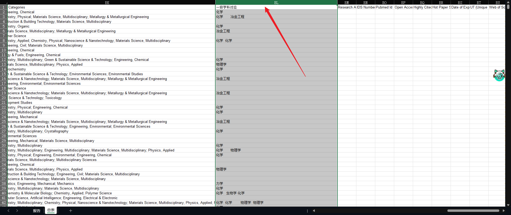
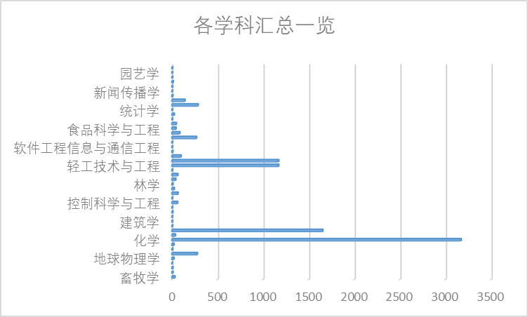
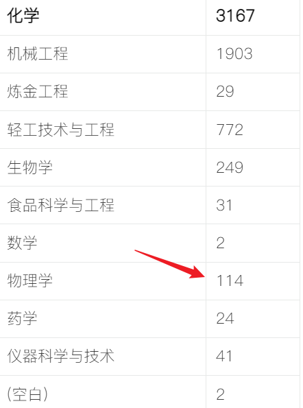
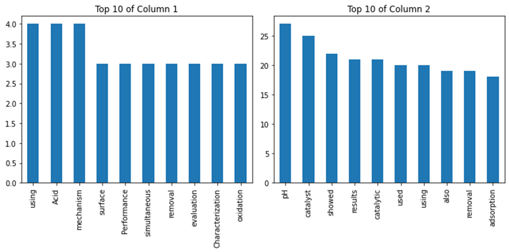
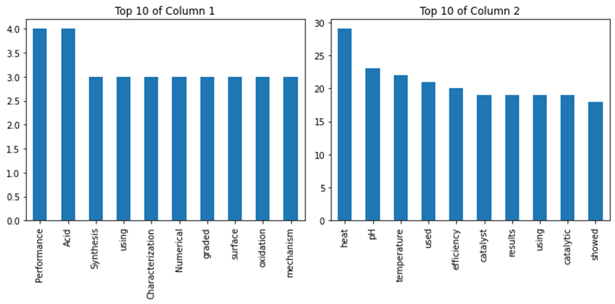
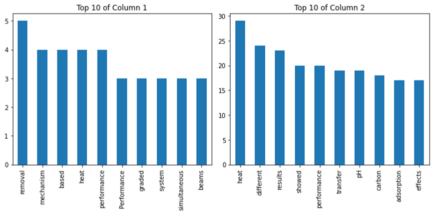

# 

# 作业要求：
1、在Web of Science数据库检索南京工业大学从2017年至今在核心合集上发表的论文数量；
2、将检索到的论文批量导出；
3、根据导出的Wos category，并根据wos category与我国一级学科对照表，统计一级学科之间的关系，如：
文章1 的 wos category为chemitry,和computer,
找到chemistry对应的一级学科为化学工程；computer对应的一级学科为计算机科学；
表明文章1是一篇跨学科文献，出现在化学工程与计算机科学中。
统计所有文章，通过求和计算出所有学科之间的关系，如：
化学工程总文献1000篇，计算机科学总文献500篇，文献同时包含化学工程与计算机科学的文献数量为40篇，则化学工程与计算机的交叉程度为40/(1000+500-40)
4、分析我校一级学科中哪些学科联系较为紧密

# 报告正文：

## step1：检索到的所有论文数量并下载
总数量为16688篇
![GDDQ{A@U896O1{Z0(]NJV%G.png](./resources/img/9e443914-4f5d-4e3b-be22-dd2691687316.png)
以下为文献下载链接（原始表）：
[8001-17001.xlsx](https://www.yuque.com/attachments/yuque/0/2023/xlsx/34023817/1680707038711-b362d4ba-54c8-41b4-8287-22d9955481a0.xlsx)
[1-1000.xls](https://www.yuque.com/attachments/yuque/0/2023/xls/34023817/1680707062481-1993bfe6-623c-4ece-bc9a-32419f9d03c2.xls)

## step2:将我校一级学科与wos catagory对应：
[一级学科与WebofScience条目对应表.pdf](https://www.yuque.com/attachments/yuque/0/2023/pdf/34023817/1680707530023-7eb7ee7b-d47d-4b1f-8b5d-a91e9d1592be.pdf)
将对应的一级学科添加到数据表的下一列

添加后还要进一步进行数据筛选，去重，清洗脏数据

## step3:对去重后的数据进行进一步的分析：
此处拿已经清洗好的数据举例：
[表1.xlsx](https://www.yuque.com/attachments/yuque/0/2023/xlsx/34023817/1680707961386-6a319cd9-14e5-4386-ae03-125ee486cf91.xlsx)

### 以化学为例：

1. 先进行筛选，筛选出所有与化学有关的学科
| **行标签** | **求和项:2** |
| --- | --- |
| 畜牧学 化学 食品科学与工程 | 28 |
| 动力工程及工程热物理 化学 | 47 |
| 动力工程及工程热物理 化学 机械工程 化学工程与技术 | 35 |
| 动力工程及工程热物理 化学 轻工技术与工程 炼金工程 机械工程 | 9 |
| 动力工程及工程热物理 机械工程 化学工程与技术 | 4 |
| 动力工程及工程热物理 机械工程 化学工程与技术 轻工技术与工程 | 2 |
| 化学 | 1720 |
| 化学 机械工程 电气工程 仪器科学与技术 | 17 |
| 化学 机械工程 化学工程与技术 | 111 |
| 化学 机械工程 化学工程与技术 轻工技术与工程 | 1 |
| 化学 机械工程 化学工程与技术 轻工技术与工程 材料科学与工程 | 53 |
| 化学 机械工程 化学工程与技术 轻工技术与工程 戏剧和影视学 | 1 |
| 化学 机械工程 轻工技术与工程 物理学 | 29 |
| 化学 炼金工程 机械工程 轻工技术与工程 戏剧和影视学 | 1 |
| 化学 轻工技术与工程 | 301 |
| 化学 轻工技术与工程 材料科学与工程 | 6 |
| 化学 轻工技术与工程 地质学 | 1 |
| 化学 轻工技术与工程 炼金工程 机械工程 | 131 |
| 化学 轻工技术与工程 炼金工程 机械工程 物理学 | 85 |
| 化学 轻工技术与工程 物理学 | 200 |
| 化学 轻工技术与工程 物理学 化学工程与技术 | 24 |
| 化学 轻工技术与工程 戏剧和影视学 | 23 |
| 化学 轻工技术与工程 戏剧和影视学 物理学 | 86 |
| 化学 生物学 | 100 |
| 化学 生物学 机械工程 化学工程与技术 轻工技术与工程 | 7 |
| 化学 生物学 临床医学 | 6 |
| 化学 生物学 轻工技术与工程 | 2 |
| 化学 生物学 软件工程 | 8 |
| 化学 生物学 生物工程 | 20 |
| 化学 生物学 生物工程 机械工程 化学工程与技术 | 17 |
| 化学 生物学 生物工程 食品科学与工程 | 3 |
| 化学 生物学 药学 | 3 |
| 化学 食品科学与工程 | 28 |
| 化学 食品科学与工程 临床医学 | 2 |
| 化学 数学 物理学 化学工程与技术 | 1 |
| 化学 物理学 | 29 |
| 化学 物理学 地质学 | 5 |
| 化学 物理学 地质学 矿业工程 | 2 |
| 化学 物理学 化学工程与技术 | 74 |
| 化学 物理学 机械工程 电气工程 测绘科学与技术 | 3 |
| 化学 物理学 物理学 化学工程与技术 | 1 |
| 化学 药学 | 19 |
| 化学 药学 临床医学 | 3 |
| 化学 药学 软件工程 | 1 |
| 化学 药学 软件工程 生物学 | 1 |
| 化学 仪器科学与技术 | 40 |
| 化学 仪器科学与技术 物理学 | 2 |
| 化学工程与技术 | 9 |
| 化学工程与技术 化学 | 11 |
| 化学工程与技术 化学 生物学 | 3 |
| 化学工程与技术 化学 生物学 软件工程 | 1 |
| 化学工程与技术 化学 生物学 生物工程 | 1 |
| 化学工程与技术 化学 仪器科学与技术 | 1 |
| 化学工程与技术 生物工程 生物学 | 4 |
| 化学工程与技术 生物工程 生物学 软件工程 统计学 | 2 |
| 化学工程与技术 生物学 | 2 |
| 机械工程 化学 | 2 |
| 机械工程 化学工程与技术 | 773 |
| 机械工程 化学工程与技术 化学 | 150 |
| 机械工程 化学工程与技术 机械工程 | 1 |
| 机械工程 化学工程与技术 机械工程 石油与天然气工程 | 5 |
| 机械工程 化学工程与技术 轻工技术与工程 | 1 |
| 机械工程 化学工程与技术 轻工技术与工程 力学 | 2 |
| 机械工程 化学工程与技术 食品科学与工程 | 1 |
| 机械工程 化学工程与技术 水利工程 | 36 |
| 机械工程 化学工程与技术 物理学 物理学 | 1 |
| 机械工程 轻工技术与工程 化学 | 1 |
| 考古学 化学 地球物理学 轻工技术与工程 | 1 |
| 控制科学与工程 化学 软件工程 仪器科学与技术 数学 统计学 | 1 |
| 轻工技术与工程 材料科学与工程 化学 | 46 |
| 轻工技术与工程 化学 | 26 |
| 轻工技术与工程 轻工技术与工程 材料科学与工程 化学 | 10 |
| 轻工技术与工程 物理学 化学 | 4 |
| 软件工程 机械工程 化学工程与技术 | 1 |
| 生物工程 生物学 化学 机械工程 化学工程与技术 | 11 |
| 生物工程 生物学 机械工程 化学工程与技术 | 36 |
| 生物工程 生物学 轻工技术与工程 化学 | 1 |
| 生物学 化学 轻工技术与工程 | 9 |
| 生物学 生物工程 生物学 化学 | 12 |
| 物理学 化学 | 8 |
| 物理学 化学工程与技术 | 3 |
| **总计** | **4468** |

### 创建数据透视表：
| **行标签** | **求和项:小记** |
| --- | --- |
| **畜牧学** | **29** |
| 化学 | 28 |
| 兽医学 | 1 |
| **船舶与海洋工程** | **7** |
| 生物学 | 7 |
| **大气科学** | **7** |
| 水利工程 | 3 |
| (空白) | 4 |
| **地理学** | **1** |
| (空白) | 1 |
| **地球物理学** | **19** |
| 测绘科学与技术 | 9 |
| 大气科学 | 2 |
| 水利工程 | 6 |
| (空白) | 2 |
| **动力工程及工程热物理** | **275** |
| 化学 | 123 |
| 机械工程 | 111 |
| 力学 | 3 |
| 数学 | 23 |
| 土木工程 | 14 |
| (空白) | 1 |
| **工商管理** | **5** |
| 管理科学与工程 | 1 |
| 应用经济学 | 3 |
| (空白) | 1 |
| **核科学与技术** | **19** |
| 物理学 | 17 |
| (空白) | 2 |
| **化学** | **3167** |
| 机械工程 | 1903 |
| 炼金工程 | 29 |
| 轻工技术与工程 | 772 |
| 生物学 | 249 |
| 食品科学与工程 | 31 |
| 数学 | 2 |
| 物理学 | 114 |
| 药学 | 24 |
| 仪器科学与技术 | 41 |
| (空白) | 2 |
| **化学工程与技术** | **34** |
| 化学 | 25 |
| 生物工程 | 5 |
| 生物学 | 2 |
| (空白) | 2 |
| **机械工程** | **1651** |
| 船舶与海洋工程 | 127 |
| 地质资源与地质工程 | 39 |
| 电气工程 | 136 |
| 动力工程及工程热物理 | 5 |
| 管理科学与工程 | 1 |
| 化学 | 15 |
| 化学工程与技术 | 971 |
| 力学 | 42 |
| 轻工技术与工程 | 111 |
| 石油与天然气工程 | 1 |
| 数学 | 17 |
| 水利工程 | 7 |
| 土木工程 | 160 |
| 仪器科学与技术 | 5 |
| (空白) | 14 |
| **基础医学** | **2** |
| 生物学 | 1 |
| (空白) | 1 |
| **建筑学** | **1** |
| 土木工程 | 1 |
| **交通运输过程** | **1** |
| (空白) | 1 |
| **教育学** | **6** |
| 物理学 | 5 |
| (空白) | 1 |
| **考古学** | **1** |
| 化学 | 1 |
| **控制科学与工程** | **58** |
| 化学 | 4 |
| 机械工程 | 28 |
| 软件工程 | 13 |
| 仪器科学与技术 | 3 |
| (空白) | 10 |
| **矿业工程** | **2** |
| (空白) | 2 |
| **力学** | **63** |
| 轻工技术与工程 | 34 |
| 物理学 | 27 |
| (空白) | 2 |
| **炼金工程** | **22** |
| 机械工程 | 22 |
| **林学** | **7** |
| 城乡规划学 | 1 |
| 轻工技术与工程 | 4 |
| (空白) | 2 |
| **临床医学** | **38** |
| 基础医学 | 34 |
| 临床医学 | 1 |
| 水利工程 | 2 |
| (空白) | 1 |
| **农业工程** | **61** |
| 机械工程 | 1 |
| 生物工程 | 53 |
| 作物学 | 7 |
| **农业资源与资源** | **2** |
| (空白) | 2 |
| **轻工技术与工程** | **1167** |
| 材料科学与工程 | 694 |
| 化学 | 46 |
| 力学 | 31 |
| 炼金工程 | 122 |
| 轻工技术与工程 | 33 |
| 物理学 | 225 |
| 戏剧和影视学 | 6 |
| (空白) | 10 |
| **轻工技术与工程 汇总** | **1167** |
| (空白) | 1167 |
| **软件工程** | **97** |
| 地理学 | 15 |
| 地球物理学 | 2 |
| 机械工程 | 57 |
| 基础医学 | 2 |
| 建筑学 | 14 |
| 轻工技术与工程 | 1 |
| 物理学 | 3 |
| 信息与通信工程 | 1 |
| (空白) | 2 |
| **软件工程机械工程** | **6** |
| 电气工程 | 2 |
| 软件工程 | 4 |
| **软件工程信息与通信工程** | **1** |
| (空白) | 1 |
| **生态学** | **1** |
| 生物学 | 1 |
| **生物工程** | **265** |
| 生物学 | 265 |
| **生物学** | **82** |
| 化学 | 54 |
| 基础医学 | 9 |
| 临床医学 | 3 |
| 软件工程 | 3 |
| 生物工程 | 1 |
| (空白) | 12 |
| **食品科学与工程** | **41** |
| 临床医学 | 39 |
| 生物学 | 1 |
| (空白) | 1 |
| **数学** | **45** |
| 力学 | 41 |
| 物理学 | 2 |
| (空白) | 2 |
| **水产** | **2** |
| 基础医学 | 1 |
| (空白) | 1 |
| **水利工程** | **22** |
| (空白) | 22 |
| **统计学** | **1** |
| (空白) | 1 |
| **土木工程** | **283** |
| 机械工程 | 262 |
| 轻工技术与工程 | 17 |
| (空白) | 4 |
| **物理学** | **139** |
| 地球物理学 | 113 |
| 化学 | 1 |
| 化学工程与技术 | 8 |
| 机械工程 | 3 |
| 力学 | 11 |
| 特种医学 | 1 |
| (空白) | 2 |
| **心理学** | **6** |
| (空白) | 6 |
| **新闻传播学** | **1** |
| (空白) | 1 |
| **信息与通信工程** | **3** |
| (空白) | 3 |
| **仪器科学与技术** | **10** |
| 轻工技术与工程 | 1 |
| 物理学 | 7 |
| (空白) | 2 |
| **应用经济学** | **2** |
| 交通运输过程 | 1 |
| (空白) | 1 |
| **园艺学** | **1** |
| (空白) | 1 |
| **作物学** | **3** |
| 农业资源与资源 | 1 |
| 生物学 | 1 |
| (空白) | 1 |
| **总计** | **8823** |

根据这个表格，可以很快遍历交叉学科的数目

根据图标可见，关联度最高的学科为：机械工程，轻工技术与工程，生物学，物理学
接下来分别计算他们的关联度：
（一）化学与物理学：

交叉程度为：114/(3167+139)-114 = 3.57%
同理，计算出几个交叉程度较高的学科：
(二) 化学与机械工程：交叉程度为：68.12%
(三) 机械工程与电气工程：交叉程度为：49.90%
（四）机械工程与仪器科学与技术：交叉程度为：49。90%
(五) 轻工技术与工程和材料科学与工程：交叉程度为：54.31%
(六) 生物工程与生物学：交叉程度为：76.13%
(七) 机械工程与电气工程：交叉程度为：49.90%
(八) 炼金工程与矿业工程：交叉程度为：63.41%
(九) 地球物理学与矿业工程工程：交叉程度为：49.78%

## step4:分析我校一级学科中哪些学科联系较为紧密
综合step3来看：
（一）我们学校的化学与机械工程联系紧密，在高文献量的情况下，它们的交叉程度高达68.12%。这说明平时的化学研究离不开与机械的交互，所以化学与机械工程联系紧密。

（二）我们学校的生物工程与生物学联系紧密，它们的交叉程度达到了76.13%。这说明在做生物工程的时候，需要用到生物学的知识，因此它们的交叉联系程度很高。

（三）我们学校的炼金工程与矿业工程联系紧密，它们的交叉程度达到了63.41%。这说明炼金的时候，需要矿业矿石的知识，了解每一种矿石的熔点等等特性，这样在做炼金工程的时候，才能做到提高利用率，不浪费资源。所以炼金工程与矿业工程密不可分。

## step5（附加任务）:对交叉学科进行词频分析，得出交叉学科的具体研究内容

## 利用python语言，导入pandas等库文件，把第一列作为题目，第二列作为摘要，对这两列的每一行进行split()分解，并且过滤停用词，最后得到词频。

## 

### 结果如下：

## 

#### 学科：化学 和 材料（标题，摘要）

## 

## 

## 

## 

#### 学科：化学 和 工程（标题，摘要）

## 

## 

#### 学科：物理 和 材料（标题，摘要）

## 

## 

# 总结：
通过对文献信息检索的学习，使我对文献信息检索的作用和意义等各方面有了更深一步的认识，我们在这其中拓宽了查找资料的渠道、学会了如何利用所学的知识对文献进行处理，不仅学会了正确的检索，收集文献，也锻炼了我们团队合作的能力，编程和算法知识的应用能力，数据处理的能力。最后，感谢老师对我的悉心指导和帮助。
