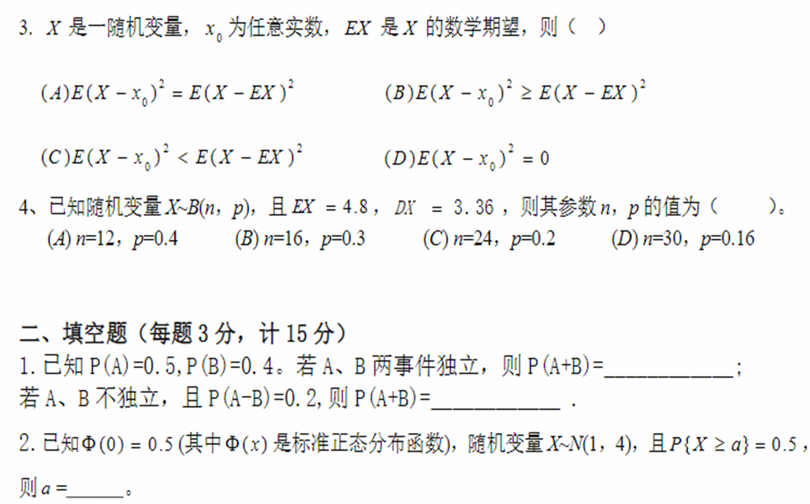
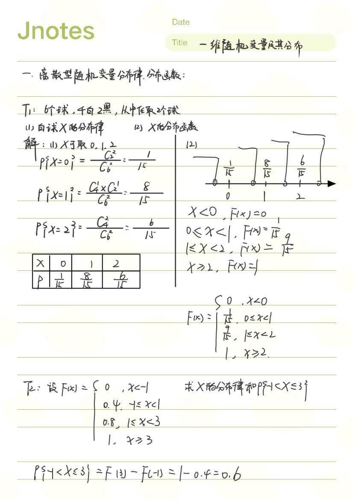
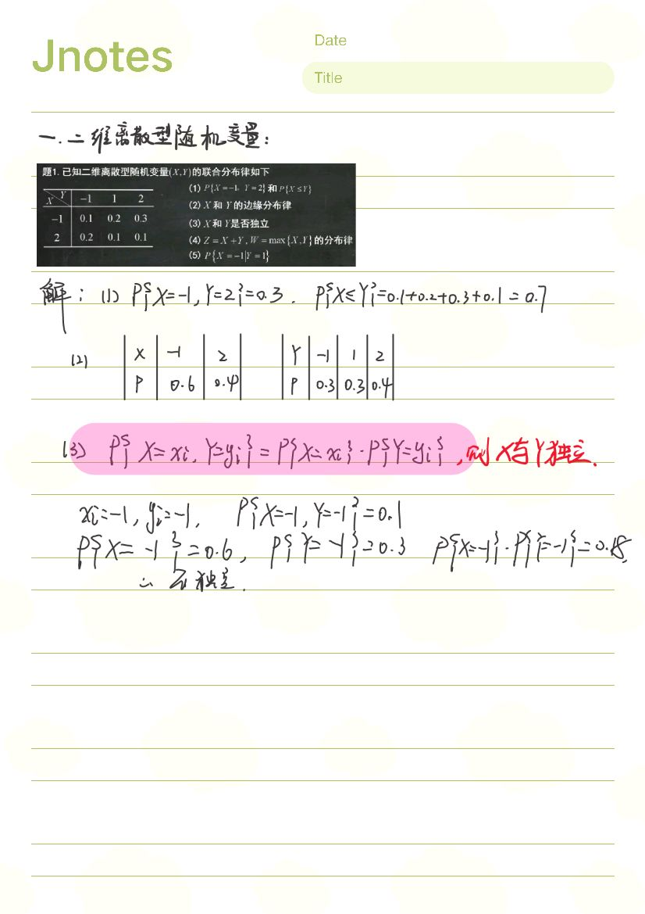

# 往年试题：

[2020-2021第一学期概率统计解答.pdf](https://www.yuque.com/attachments/yuque/0/2023/pdf/34023817/1686672328445-f4953496-e048-4f21-a77d-e0bbc8819b45.pdf)

[2020-2021第一学期概率统计试卷（).pdf](https://www.yuque.com/attachments/yuque/0/2023/pdf/34023817/1686672328441-c53123a7-b5c6-4bcd-adf0-888899bc5bd7.pdf)

[概率统计（19～20-1A）j.pdf](https://www.yuque.com/attachments/yuque/0/2023/pdf/34023817/1686672328439-11125242-0ef7-460e-9af5-5ba2c7b64de7.pdf)

[2020-2021第一学期概率论与数理统计（20～21-1）解答.pdf](https://www.yuque.com/attachments/yuque/0/2023/pdf/34023817/1686672328472-8c796d71-e655-4b8b-8948-0bd180dd6d0d.pdf)

[2020-2021第一学期概率论与数理统计试题()卷.pdf](https://www.yuque.com/attachments/yuque/0/2023/pdf/34023817/1686672328463-6c79f187-a65c-4fad-b52a-07a799ca890a.pdf)

# 第一章

# 第二章

# 第三章

# 第四章

# 第五章

# 第六章

# 往年试题部分解析

