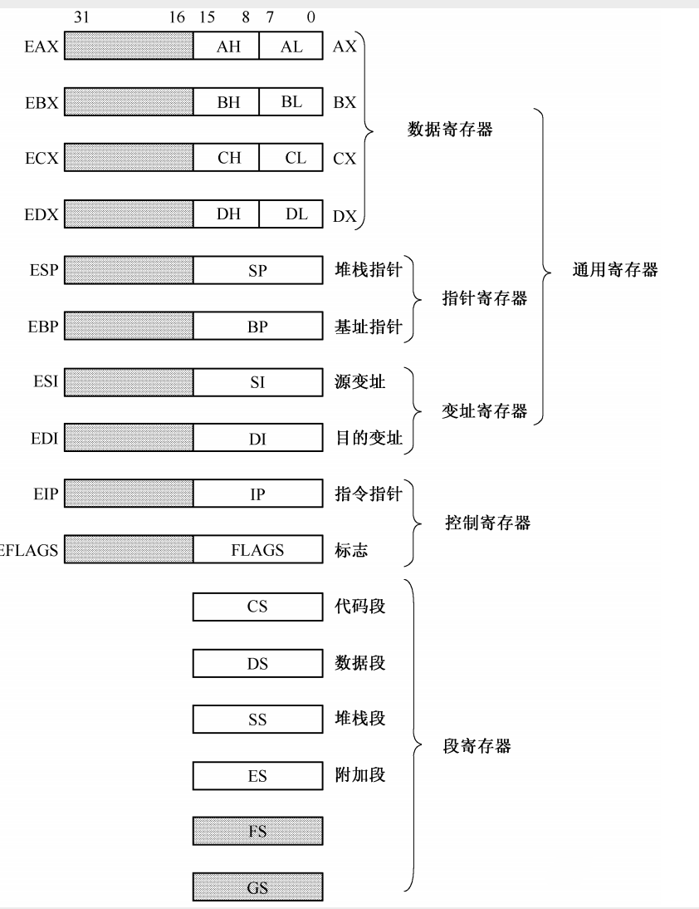
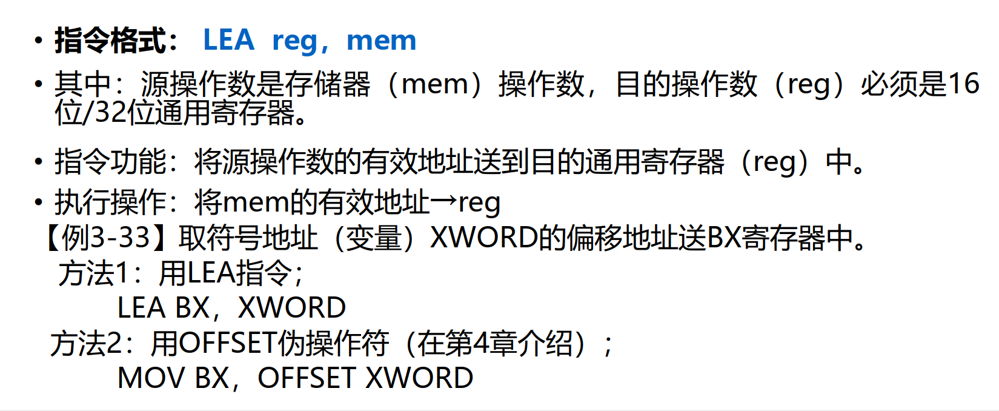
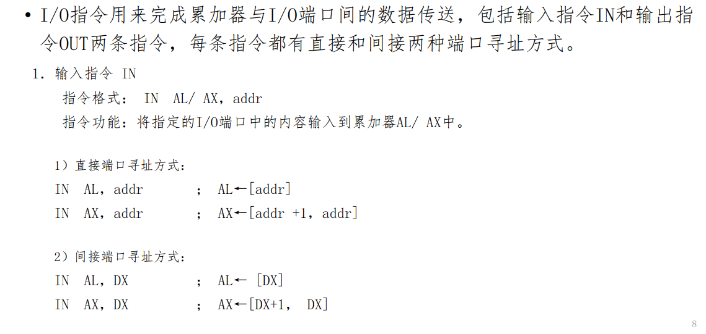
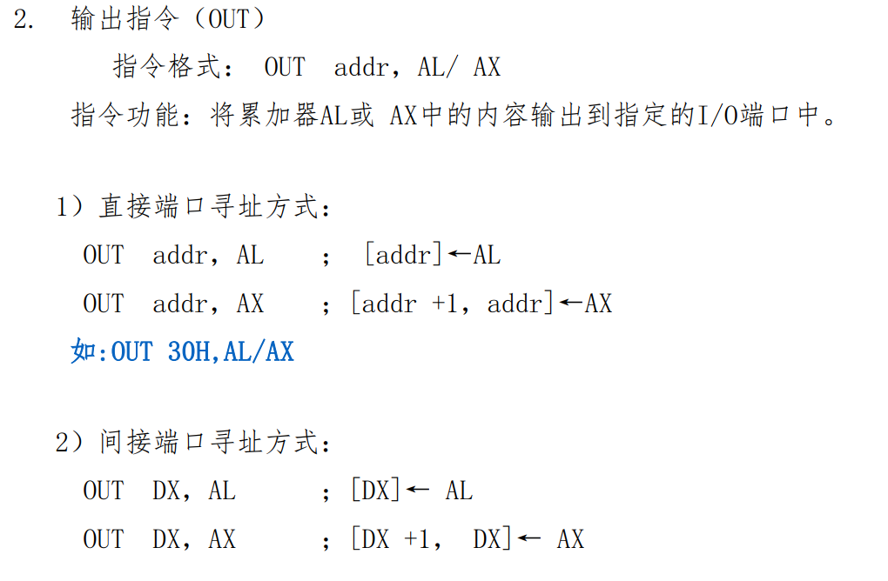
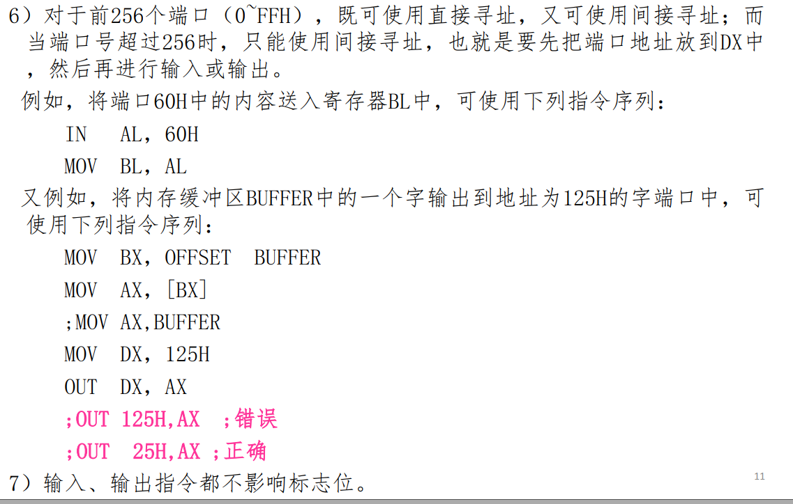
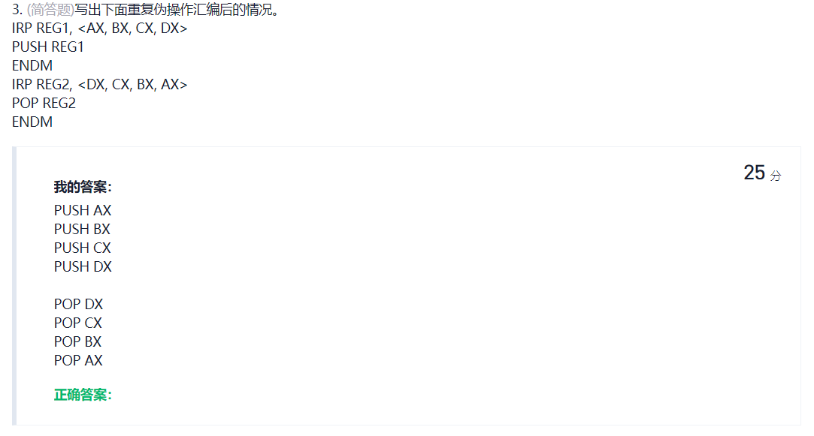

寄存器与它们的主要功能：用于寻址的有哪些（段地址，基址、变址，以及它们的对应关系），用于计算的标志位有哪些，数据在内存里的存放示意图

熟悉常用指令的规则（数据传送指令MOV，输入输出指令），能判定指令是否符合语法规则，并纠正错误。

LEA指令：

算术运算指令（ADD，SUB，CMP，TEST）对标志位（CF，OF，SF，ZF）的影响，并能得出正确的运算结果。

熟悉重复汇编指令（IRP/IRPC，&），能写出重复汇编后的程序清单。

