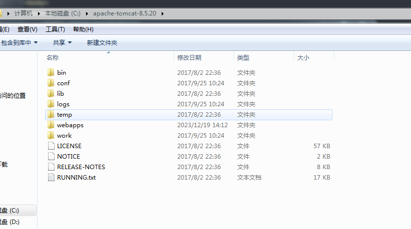
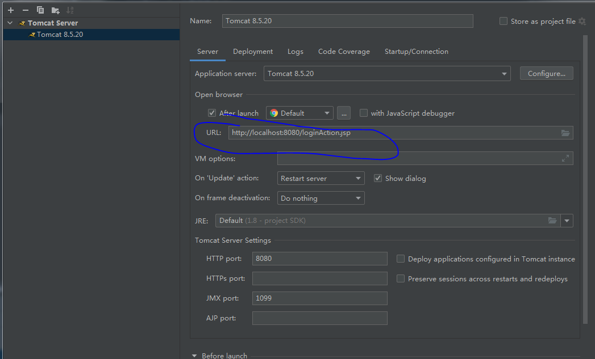
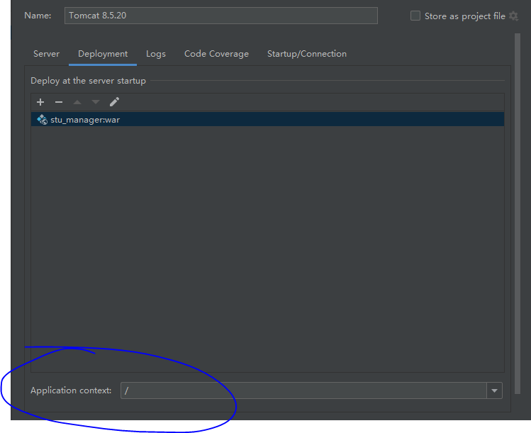
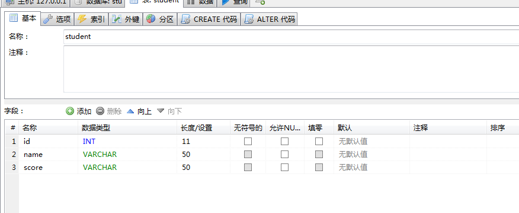

## 环境配置：
找到C盘中的Tomcat，并引入。

在IDEA中导入Tomcat的配置

修改为如下路径

## 数据库设置

## 文件：
[stu_manager.zip](https://www.yuque.com/attachments/yuque/0/2023/zip/34023817/1702966932996-13c030cf-19ed-45e3-aa2d-702f0ad0e3b5.zip?_lake_card=%7B%22src%22%3A%22https%3A%2F%2Fwww.yuque.com%2Fattachments%2Fyuque%2F0%2F2023%2Fzip%2F34023817%2F1702966932996-13c030cf-19ed-45e3-aa2d-702f0ad0e3b5.zip%22%2C%22name%22%3A%22stu_manager.zip%22%2C%22size%22%3A17374316%2C%22ext%22%3A%22zip%22%2C%22source%22%3A%22%22%2C%22status%22%3A%22done%22%2C%22download%22%3Atrue%2C%22taskId%22%3A%22uc2b6b01d-78b7-4ae7-9a90-471fddb2381%22%2C%22taskType%22%3A%22upload%22%2C%22type%22%3A%22application%2Fx-zip-compressed%22%2C%22__spacing%22%3A%22both%22%2C%22mode%22%3A%22title%22%2C%22id%22%3A%22u22d26d8a%22%2C%22margin%22%3A%7B%22top%22%3Atrue%2C%22bottom%22%3Atrue%7D%2C%22card%22%3A%22file%22%7D)

[metting_manager.zip](https://www.yuque.com/attachments/yuque/0/2023/zip/34023817/1703053882449-4915b1ca-5238-4c8f-b027-58277491e5e4.zip?_lake_card=%7B%22src%22%3A%22https%3A%2F%2Fwww.yuque.com%2Fattachments%2Fyuque%2F0%2F2023%2Fzip%2F34023817%2F1703053882449-4915b1ca-5238-4c8f-b027-58277491e5e4.zip%22%2C%22name%22%3A%22metting_manager.zip%22%2C%22size%22%3A17768742%2C%22ext%22%3A%22zip%22%2C%22source%22%3A%22%22%2C%22status%22%3A%22done%22%2C%22download%22%3Atrue%2C%22taskId%22%3A%22ucda2ed22-7837-49dc-8cab-f7bca1dc431%22%2C%22taskType%22%3A%22upload%22%2C%22type%22%3A%22application%2Fx-zip-compressed%22%2C%22__spacing%22%3A%22both%22%2C%22id%22%3A%22u7fcf71ab%22%2C%22margin%22%3A%7B%22top%22%3Atrue%2C%22bottom%22%3Atrue%7D%2C%22card%22%3A%22file%22%7D)

