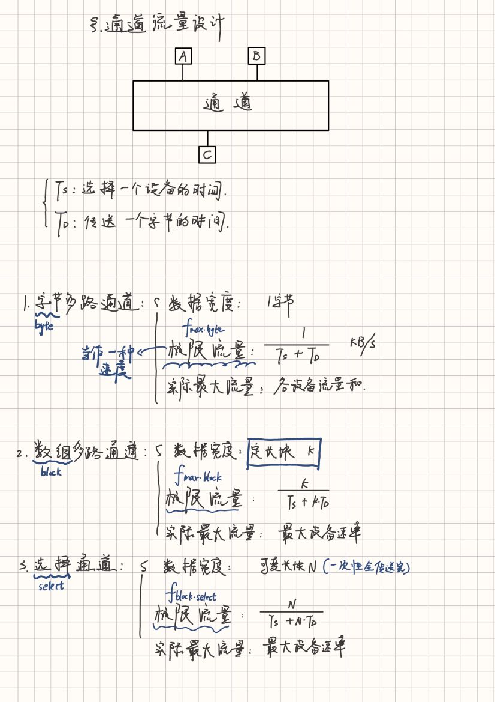

# 题库
[系统结构试题库（完全）.doc](https://www.yuque.com/attachments/yuque/0/2024/doc/34023817/1719713875025-4262965d-cd14-4ec7-83bc-d00de840360c.doc?_lake_card=%7B%22src%22%3A%22https%3A%2F%2Fwww.yuque.com%2Fattachments%2Fyuque%2F0%2F2024%2Fdoc%2F34023817%2F1719713875025-4262965d-cd14-4ec7-83bc-d00de840360c.doc%22%2C%22name%22%3A%22%E7%B3%BB%E7%BB%9F%E7%BB%93%E6%9E%84%E8%AF%95%E9%A2%98%E5%BA%93%EF%BC%88%E5%AE%8C%E5%85%A8%EF%BC%89.doc%22%2C%22size%22%3A312832%2C%22ext%22%3A%22doc%22%2C%22source%22%3A%22%22%2C%22status%22%3A%22done%22%2C%22download%22%3Atrue%2C%22taskId%22%3A%22u5abe197a-962e-4e69-84d3-cb3ded54b4e%22%2C%22taskType%22%3A%22upload%22%2C%22type%22%3A%22application%2Fmsword%22%2C%22__spacing%22%3A%22both%22%2C%22mode%22%3A%22title%22%2C%22id%22%3A%22u442eaa27%22%2C%22margin%22%3A%7B%22top%22%3Atrue%2C%22bottom%22%3Atrue%7D%2C%22card%22%3A%22file%22%7D)
[系统结构试题库（学生版） (1).doc](https://www.yuque.com/attachments/yuque/0/2024/doc/34023817/1719713874856-4c2239b6-5bcf-4f4a-a3a1-6e55d8c481de.doc?_lake_card=%7B%22src%22%3A%22https%3A%2F%2Fwww.yuque.com%2Fattachments%2Fyuque%2F0%2F2024%2Fdoc%2F34023817%2F1719713874856-4c2239b6-5bcf-4f4a-a3a1-6e55d8c481de.doc%22%2C%22name%22%3A%22%E7%B3%BB%E7%BB%9F%E7%BB%93%E6%9E%84%E8%AF%95%E9%A2%98%E5%BA%93%EF%BC%88%E5%AD%A6%E7%94%9F%E7%89%88%EF%BC%89%20(1).doc%22%2C%22size%22%3A191488%2C%22ext%22%3A%22doc%22%2C%22source%22%3A%22%22%2C%22status%22%3A%22done%22%2C%22download%22%3Atrue%2C%22taskId%22%3A%22u4ad3ff40-766c-4548-a471-4ff55343acd%22%2C%22taskType%22%3A%22upload%22%2C%22type%22%3A%22application%2Fmsword%22%2C%22__spacing%22%3A%22both%22%2C%22mode%22%3A%22title%22%2C%22id%22%3A%22uee8c5fcb%22%2C%22margin%22%3A%7B%22top%22%3Atrue%2C%22bottom%22%3Atrue%7D%2C%22card%22%3A%22file%22%7D)

# 计算题

## 规格化浮点数

## 计算CPI,MIPS,Tcpu类
**P11-12的四个公式**

## 哈夫曼树，扩展编码类   
**P57-58，P63-64，重点是哈夫曼树的画法，扩展编码的原则（短码不能是长码的前缀）**

## 求加速比，性能提升类   
**主要是P13的Amdahl定律，掌握公式，参考【例1-7】**
$ S_p = \frac{1}{1-f_{new}+\frac{f_{new}}{r_{new}}} $

## 求通道极限流量，实际流量，挂载设备数类   
P103-106，参考【例3-4】【例3-5】

 

## 中断
会画图，会写屏蔽位

## 画流水线时空图，求Tp,Sp,h类 
**P173-176，记住Tp,Sp,h的公式，参考【例5-2】**

## 非线性流水线调度  
**P184-187，禁止表，冲突向量，状态图的画法，参考【例5-3】**

# 简答题

1. **通道分哪3种类型？简述各自的工作原理？ **

字节多路通道，数组多路通道，选择通道
选择通道：以数据块为单位。
原理：在物理上它可以连接多个设备，但是这些设备不能同时工作，在某一个时间段内通道只能选择一个设备进行工作。
应用：主要用于连接高速外围设备，如磁盘、磁带等，信息以成组方式高速传输。

字节多路通道：以字节为单位。
原理：每个设备分时占用一个很短的时间片，不同的设备在各自分得的时间片内与通道建 立连接，实现数据的传输。
应用：用于连接控制多台低速外设，以字节交叉方式传送数据。

数组多路通道：以数据块为单位。
原理：连接控制多个高速外设并以成组交叉方式传送数据的通道称为数组多路通道。
应用：适用于高速外围设备，例如硬盘等。

2. **简述指令系统设计的基本思想。      P42 **

3. **简述指令系统设计原则和注意事项。 **

设计原则：特别注意如何支持搞笑的优化编译系统，简易的将源程序翻译成目标代码，尽可能高速实现频繁使用的指令。
注意事项：指令的规整性，完整性，高效率和兼容性（？）

4. **复杂指令集和精简指令集的优缺点。**

复杂指令集计算机（CISC）
优点

1. **丰富的指令集**：CISC 处理器具有大量的指令，可以直接执行复杂的操作，这使得编写汇编代码更加方便，程序员可以使用高层次的指令来完成复杂任务。
2. **代码密度高**：由于单条指令可以执行更多的操作，CISC 程序通常比 RISC 程序更短，这可以减少程序的存储空间需求。
3. **内存访问灵活**：CISC 处理器通常支持多种寻址模式和复杂的内存访问方式，这使得处理复杂的数据结构更加方便。

缺点

1. **指令执行速度较慢**：由于每条指令可能需要多个时钟周期才能完成，CISC 处理器的指令执行速度通常较慢。
2. **硬件复杂度高**：为了支持复杂的指令集和多种寻址模式，CISC 处理器的设计和实现更加复杂，这增加了硬件成本和设计难度。
3. **功耗较高**：复杂的硬件设计和较长的指令执行时间使得 CISC 处理器的功耗通常较高。

精简指令集计算机（RISC）
优点

1. **指令执行速度快**：RISC 处理器的指令集设计简洁，每条指令通常在一个时钟周期内完成，这使得指令执行速度较快。
2. **硬件实现简单**：由于指令集简洁，RISC 处理器的硬件设计相对简单，这降低了设计成本和实现难度。
3. **功耗较低**：简洁的硬件设计和快速的指令执行使得 RISC 处理器的功耗通常较低，这对移动设备和嵌入式系统尤为重要。
4. **优化编译器**：RISC 处理器的简洁指令集使得编译器可以更容易地进行优化，从而生成高效的机器代码。

缺点

1. **代码密度低**：由于每条指令执行的操作较少，RISC 程序通常比 CISC 程序更长，这可能增加程序的存储空间需求。
2. **内存访问受限**：RISC 处理器通常只有简单的寻址模式，这可能使得处理复杂的数据结构变得不太方便。
3. **指令集学习曲线**：由于 RISC 的指令集较为简单，程序员可能需要编写更多的指令来完成复杂任务，这可能增加编写汇编代码的难度。

5. **流水的理论**

6. **流水线操作中有会出现哪几种相关?     P83 **

结构相关，数据相关，控制相关
