# 赞助支持
:::info
如果你觉得这个文档帮助到了你，你可以请作者喝杯咖啡表示鼓励 ☕️**（各位衣食父母可怜可怜孩子）**
:::

# 复习重点
开卷考试 中文
六大题，一个大题是单个的，其他五个有两个小题

# 第一章 引言
要求掌握基本概念，不纳入考试范围

# 第二章 软件过程模型 重点掌握
1、每个模型的优缺点，特点，适合场所，改进
2、增量式开发，增量式交付、原型的特点、面向复用的开发

# 第三章    敏捷开发 大致了解
1、开发的原则

# 第四章 需求工程 
1、什么是功能和非功能需求，如何来描述
2、非功能需求的分类（每大类的需求）

# 第五章 系统建模  都要掌握
1、几类模型都需掌握
2、5.5不考

# 第六章 体系结构设计
1、什么是体系结构设计
2、形成的体系结构模型是怎样的

# 第七章 设计和实现
1、掌握对象类的识别、设计
2、通过模型来表示用例的实现

# 第八章 软件测试
1、软件的测试步骤、阶段
2、每个测试的重点是什么

# 第九章 软件演化
1、软件维护的概念

# 第十章
1、软件生命周期阶段、通用活动

# 第二十二章 项目管理
1、22.1.1、22.1.2 

# 第二十三章 项目计划
·1、23.6 COCOMO成本建模
**2023期末复习大纲**

# 第1章：
基本软件过程活动：software specification、design & implementation、validation、evolution

# 第2章：
软件过程过程模型：瀑布模型（waterfall）、增量式开发(incremental development)、集成和配置(integration & configuration)、原型(prototype)、增量式交付(incremental delivery)

# 第4章：
功能性需求和非功能性需求，需求描述

# 第5章：
用例模型（use case）、序列图（sequence diagram）、类图、状态图（state machine）、活动图（activity diagram）

# 第6章：
体系结构模型：4+1视图，体系结构模式：MVC、仓库模型（repository）、层模型（layer）、client/server

# 第7章：
类的识别和设计，设计模型参照第5章内容

# 第8章：
软件测试活动，测试用例（test case），等价类划分（equivalent partition）、路径测试（path test）、接口测试、基于需求的测试、确认测试

# 第22章： 
风险管理

# 第23章： 
cocomo2模型
*其它：课后习题

# 第一章 概述
好的软件的基本属性
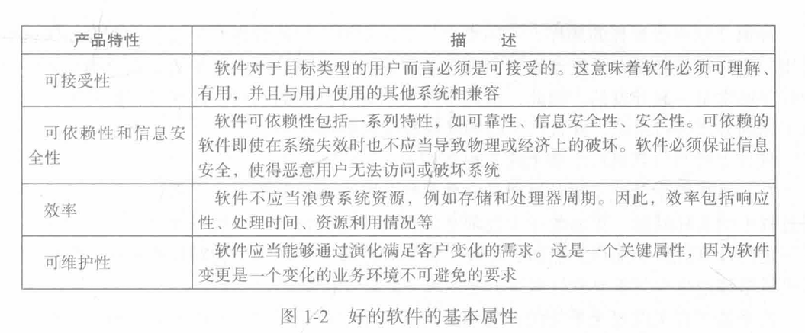

# 第二章 软件过程

1. **软件规格说明software specification**

软件规格说明，客户和工程师定义所要生产的软件以及对其运行的约束。

2. **软件开发design & implementation**

软件开发，对软件进行设计和编程实现。系统的设计和实施，以确保系统始终满足要求。

3. **软件确认Validation**

软件确认，对软件进行检查以保证它是客户所需要的。

4. **软件演化Evolution**

软件演化，对软件进行修改以反映客户和市场需求的变化。

# 第二章 软件过程模型

## 软件过程活动

1. **软件规格说明**：软件的功能以及软件运行的约束
2. **软件开发**：必须开发符合规格说明的软件
3. **软件确认**：确保软件是客户所想要的
4. **软件演化**：软件必须演化来满足不断变化的客户需要

## 软件过程模型

### 瀑布模型（waterfall）
**瀑布模型中不同的阶段:**
1.需求分析和定义
2.系统和软件设计
3.实现和单元测试
4.集成和系统测试
5.运行和维护
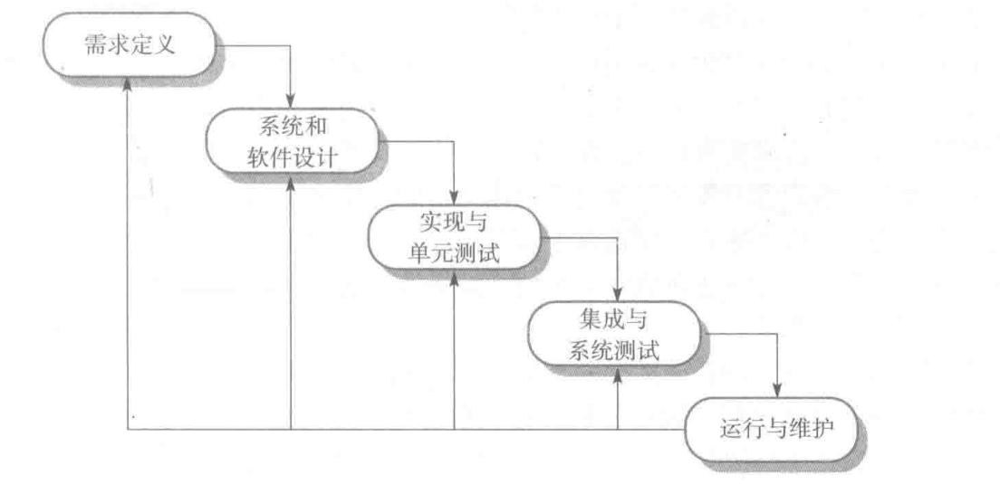
**瀑布模型的优点**

1. 强迫开发人员采用规范的方法
2. 严格规定了每个阶段必须提交的文件
3. 要求每个阶段的产品必须经过质量小组的仔细验证
4. 因为有文档维护时容易

**瀑布模型的缺点**

1. 瀑布模型的主要缺点是在过程开始后很难适应变化。原则上，一个阶段在进入下一个阶段之前必须完成。
2. 不能灵活划分为不同的阶段，难以应对不断变化的客户需求。
- 只有在全面理解了需求，而且在系统开发过程中不太可能发生重大改变的时候，可以采用瀑布模型。
- 很少有业务系统具有稳定的需求。
3. 瀑布模型主要用于大型系统工程项目，其中一个系统是在几个地点开发的。

**瀑布的适用的系统**

1. 嵌入式系统
2. 关键性系统
3. 大型软件系统

### 增量式开发(incremental development)
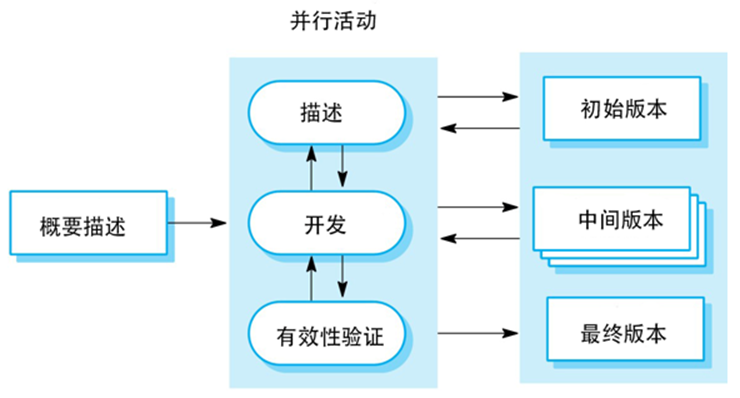
**增量式开发的优点**
1.降低了适应用户需求变更的成本。
2.在开发过程中更容易得到用户对于己做的开发工作的反馈意见。
3.使更快地交付和部署有用的软件到客户方变成了可能

**增量式开发的问题**
1.过程不可见
2.伴随着新的增量的添加，系统结构会逐渐退化

### 集成和配置/面向复用的软件过程(integration & configuration)
**过程阶段：**

- 组件分析
- 需求修改
- 使用复用的系统设计
- 开发和集成

**软件构件类型**
通过标准服务开发的可用于远程调用的Web服务 。 
包和组件框架（如NET或者J2EE等集成在一起）的对象的集合。
独立的软件系统，通过配置在特定的环境下使用。

### 原型(prototype)
**软件原型可以用在：**
在需求工程过程中， 原型有助于启发和验证系统需求。
在系统设计过桯中， 原型可用于探索特定软件的解决方案，并支持用户接口设计。
在测试过程中，进行回归测试。
**原型的好处**
提高系统可用性，更贴近用户的实际需求，改善设计质量，提高可维护性，减少开发工作
**原型开发的过程**
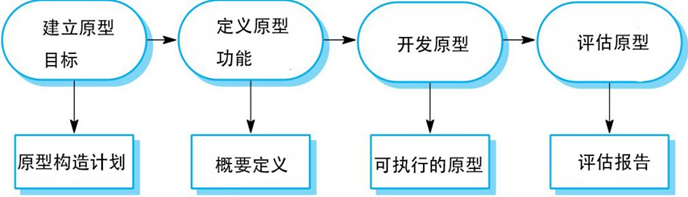
**原型开发**
可能是基于快速原型语言或工具
可能涉及遗漏功能
关注于那些不是理解很清楚的区域
错误检测和系统恢复一般不包括在原型中
关注功能性需求，而不是非功能性需求，比如可靠性和安全性；
**抛弃原型**
原型应该在开发后丢弃，它们不是生产系统的良好基础:
不可能调整原型以满足非功能性的要求
开发过程中的快速变化必然意味着原型是没有文档的
原型开发过程中的变更可能会破坏系统的结构
原型可能不符合正常的组织质量标准

### 增量式交付(incremental delivery)
增量式交付
部署供最终用户使用的增量;
关于软件实际使用的更实际评估;
难以实现替换系统，因为增量的功能比被替换的系统少。
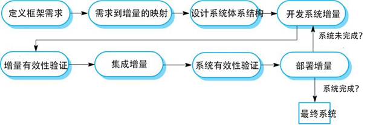
**增量式交付的优势**
降低项目整体失败的风险。
具有最高优先权的服务接受了最多的测试。
**增量式交付的问题**
当新系统准备替换一个已有的系统时，迭代化交付会有问题。
用户需要旧系统的所有功能，通常不愿意用一个不完整的新系统进行测试。
大多数系统需要一组由系统不同部分所使用的基本设施。 
增量实现之前相关的需求并没有详细定义，所以很难确定所有增量都需要的公用基础设施。
迭代过程的本质是软件规格说明和软件一起开发的。
然而，这与许多机构的采购方式相冲突，因为完整的系统规格说明往往作为系统开发合约的一部分。

# 第三章：敏捷软件开发

## 敏捷开发的原则
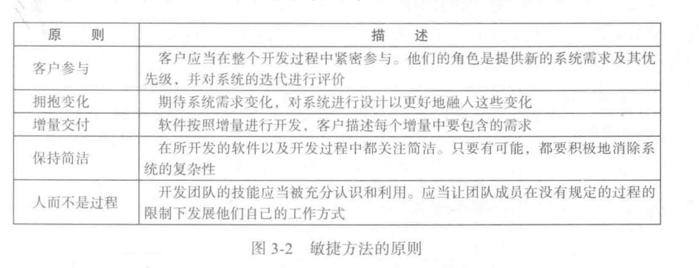

## 用户故事

# 第四章 需求工程
功能性需求和非功能性需求，需求描述

## 功能性需求
功能需求描述系统所提供的功能或服务。
它取决于开发的软件类型、软件潜在的用户，使用软件的系统的类型。
功能性用户需求可能是系统应该做什么的高级声明。
功能性系统需求则需要详细地描述系统服务。

## 非功能性需求
定义了系统属性和约束，例如可靠性、响应时间和存储需求。约束包括I/O设备能力、系统表示等。
也可以指定过程需求，要求使用特定的IDE、编程语言或开发方法。
非功能性需求通常会比个别的功能性需求更加关键。如果一个非功能系统需求没有满足则可能使整个系统无法使用。
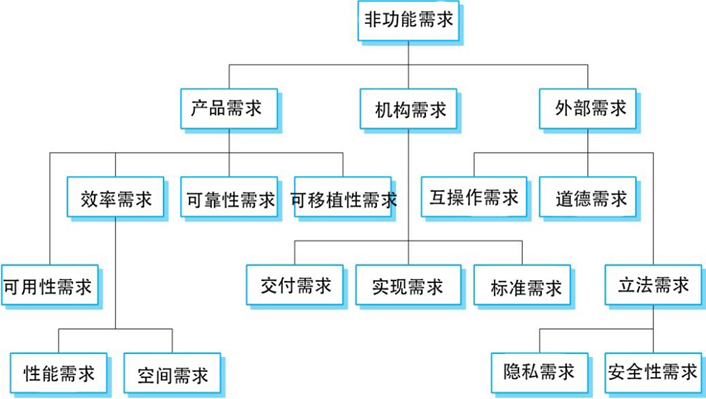

## 需求描述

### 故事和场景(Stories and scenarios)
一个场景可以包括：

1. 场景开始时对系统及用户所期望的条件的描述；
2. 对场景中常规的事件流的描述；
3. 关于哪些可能出错以及如何解决问题的描述；
4. 关于可能同时进行的其他活动的信息：
5. 场景结束时对系统状态的描述

【例 Figure 4-9】
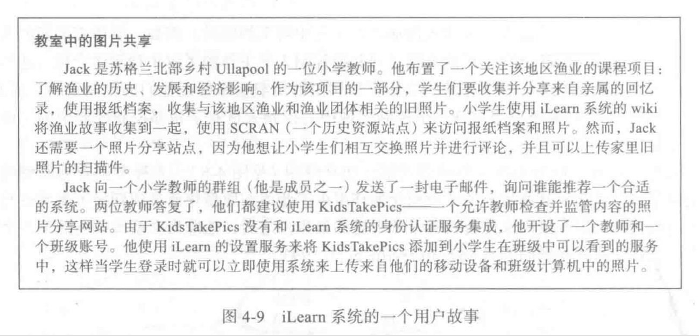
【例 Figure 4-10】
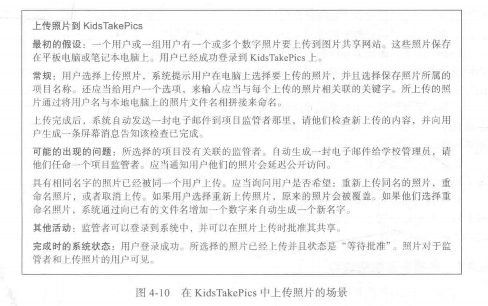

## 结构化规格说明
**结构化规格说明**
结构化自然语言是书写系统需求时的一种方法，需求的作者的自由受到限制，所有的需求都要以一种标准方式来书写。
这对于某些类型的需求(例如嵌入式控制系统的需求)很有效，但有时对于编写业务系统需求来说太过严格。
**基于表单的规格说明**

1. 关于所定义的功能或实体的描述。
2. 关于输入及输入来源的描述。
3. 关于输出及输出去向的描述。
4. 关于计算所需要的信息以及系统中所使用的其他实体的信息。
5. 关于所采取的行动的描述。
6. 如果使用了一个功能方法，前置条件设定在此函数被调用之前什么逻辑子句必须为真；后置条件设定该功能执行之后什么逻辗子句应该为真。
7. 关于操作的副作用（如果有的话）的描述

【例 Figure 4.13】
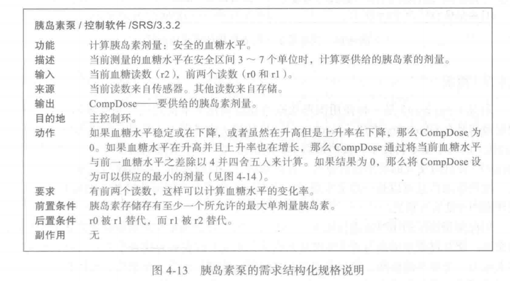
【例 Figure 4.14】
**表格规格说明**
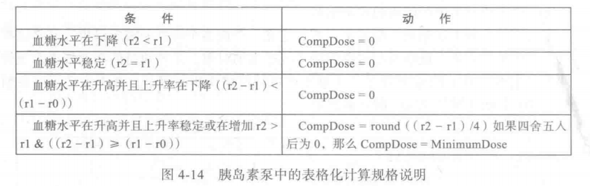

# 软件测试

## 程序测试目标
1.向开发者和用户展示软件满足了需求。
2.为了找出软件中的缺陷和不足，即软件的行为是不正确的、所不希望的或不符合它的描述的。

## 有效性测试和缺陷测试
1.有效性测试可达成第一个目标:即在这一阶段中使用系统所希望的使用方式的一组测试案例来测试系统的表现。
过程:1向开发人员和系统客户演示软件满足其需求2一次成功的测试表明，系统按预期运行
2.缺陷测试可达成第二个目标:即在这一阶段测试案例是设计来暴露系统的缺陷。测试案例可以是故意模糊的并且不需要反映系统通常是怎样使用的。
缺陷测试
过程：1发现软件中行为不正确或不符合其规范的错误或缺陷2成功的测试是使系统执行不正确，从而暴露系统缺陷的测试。

**审查和测试**

## 软件审查的优点
1.在测试期间，一个错误可能会掩盖其他错误。因为审查是一个静态的过程，我们不必关心错误之间的相互作用。
2.审查一个系统的不完整版本不需要额外的代价。如果一个程序不完整，我们需要开发特殊测试工具来测试可用的部分。
3.除了搜索程序缺陷，审查也可以考虑一个程序更广泛的质量属性，如符合标准、可移植性和可维护性。

## 软件测试过程模型

**测试阶段**
1.开发测试，即在开发中进行系统测试来发现故障和缺陷。
2.发布测试，即一个测试小组对一个系统的完整版本进行测试，然后发布给用户。
3.用户测试，即系统的用户或是潜在的用户在他们自己的环境中测试这个系统。

**接口测试**
1.接口类型
§  参数接口在这些接口中，主要是数据和函数指针，由一个组件传递到另一个组件。
§  共享内存接口在这些接口中，有一个被子系统共享的内存块。
§  程序接口在这些接口中，有子系统封装的一组程序，这些程序可以被其他子系统调用。
§  消息传递接口在这些接口中，子系统通过消息传递来请求其他子系统上的服务。
2.接口错误：1接口误用2接口误解3时序错误
3.接口测试准则1设计一组测试集，使得对传给外部组件的参数的值选择紧靠取值范围边缘的那些值。2当有指针从接口传递时，总用空指针参数来测试接口。3当组件通过程序接口被调用时，设计一些容易引起组件失败的测试。4在消息传递系统中进行强度测试。5当组件间通过共享内存来交互时，可以设计一种测试，使其对激活组件的次序有所改变。

**测试驱动开发过程活动**
1.从识别所需要的功能增量开始。这个通常应该比较小，用几行代码就可以实现。
2.针对此功能编写一个测试并实现为一个自动测试。
3.然后运行此测试，以及所有已实现的其他测试。最初，我们并没有实现这个功能，因此这个新的测试将是失败的。 
4.然后是实现这个功能，并重新运行这个测试。
5.一旦所有的测试成功，我们可以转去实现下一个功能块。

**测试驱动开发的优势**
1.代码覆盖：原则上，我们所写的每个代码片段都至少有一个测试。因此，我们可以确信系统中的所有代码都实际执行过。
2.回归测试：随着一个程序的开发，一个测试套件也增量式开发出来。
3.简化调试:当一个测试失败的时候，问题出在何处是很明显的。新写的代码需要审查和修改。
4.系统文档:测试本身就表现为一种文档形式，它描述了代码应该做什么。

**接收测试过程**

**要点**
1.测试只能证明系统中存在错误。它不能说明系统中不再有缺陷。
2.开发测试是软件开发小组的责任。独立的测试小组应该在系统发布给客户之前负起测试系统的责任。
3.开发测试包括单元测试，即测试单个对象和方法；组件测试，即测试相关的一组对象；系统测试，即测试部分或完整的系统。
4.测试软件时，我们应该根据经验和原则把软件打散来选择测试案例的类型，选择那些在其他系统中已经证明是能有效地发现缺陷的那些测试案例类型。
5.有可能的话，我们应该编写自动化测试。将这个测试嵌人到程序中，这样的程序可以每次当系统一有变化就运行。
6.测试优先开发是开发的一种方法，在代码测试之前就巳经写好测试。
7.情景测试是非常有用的，因为它可以复制系统的使用。
8.接收测试是一个用户的测试过程，目的是决定这个软件是否足以进行部署。以及能否用在它的实际操作环境中。
