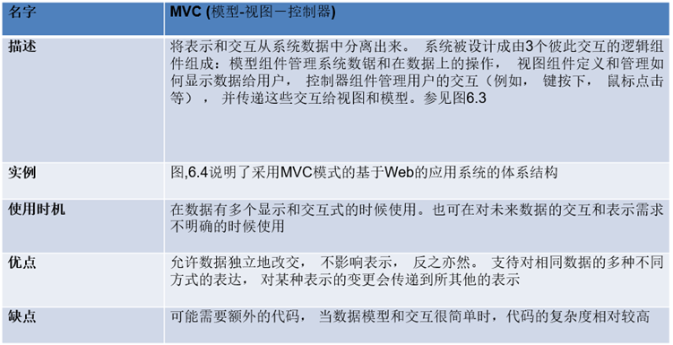

开卷考试 中文
六大题，一个大题是单个的，其他五个有两个小题

# 第一章 引言
要求掌握基本概念，不纳入考试范围

# 第二章 软件过程模型 重点掌握
1、每个模型的优缺点，特点，适合场所，改进
2、增量式开发，增量式交付、原型的特点、面向复用的开发

# 第三章    敏捷开发 大致了解
1、开发的原则

# 第四章 需求工程 
1、什么是功能和非功能需求，如何来描述
2、非功能需求的分类（每大类的需求）

# 第五章 系统建模  都要掌握
1、几类模型都需掌握
2、5.5不考

# 第六章 体系结构设计
1、什么是体系结构设计
2、形成的体系结构模型是怎样的

# 第七章 设计和实现
1、掌握对象类的识别、设计
2、通过模型来表示用例的实现

# 第八章 软件测试
1、软件的测试步骤、阶段
2、每个测试的重点是什么

# 第九章 软件演化
1、软件维护的概念

# 第十章
1、软件生命周期阶段、通用活动

# 第二十二章 项目管理
1、22.1.1、22.1.2 

# 第二十三章 项目计划
·1、23.6 COCOMO成本建模
**2023期末复习大纲**

# 第1章：
基本软件过程活动：software specification、design & implementation、validation、evolution

# 第2章：
软件过程过程模型：瀑布模型（waterfall）、增量式开发(incremental development)、集成和配置(integration & configuration)、原型(prototype)、增量式交付(incremental delivery)

# 第4章：
功能性需求和非功能性需求，需求描述

# 第5章：
用例模型（use case）、序列图（sequence diagram）、类图、状态图（state machine）、活动图（activity diagram）

# 第6章：
体系结构模型：4+1视图，体系结构模式：MVC、仓库模型（repository）、层模型（layer）、client/server

# 第7章：
类的识别和设计，设计模型参照第5章内容

# 第8章：
软件测试活动，测试用例（test case），等价类划分（equivalent partition）、路径测试（path test）、接口测试、基于需求的测试、确认测试

# 第22章： 
风险管理

# 第23章： 
cocomo2模型
*其它：课后习题

# 第一章 概述
好的软件的基本属性

# 第二章 软件过程

## 软件过程活动

1. **软件规格说明software specification**：软件的功能以及软件运行的约束
2. **软件开发design & implementation**：必须开发符合规格说明的软件
3. **软件确认Validation**：确保软件是客户所想要的
4. **软件演化Evolution**：软件必须演化来满足不断变化的客户需要

## 软件过程模型

### 瀑布模型（waterfall）
**瀑布模型中不同的阶段:**
1.需求分析和定义
2.系统和软件设计
3.实现和单元测试
4.集成和系统测试
5.运行和维护

**瀑布模型的优点**

1. 强迫开发人员采用规范的方法
2. 严格规定了每个阶段必须提交的文件
3. 要求每个阶段的产品必须经过质量小组的仔细验证
4. 因为有文档维护时容易

**瀑布模型的缺点**

1. 瀑布模型的主要缺点是在过程开始后很难适应变化。原则上，一个阶段在进入下一个阶段之前必须完成。
2. 不能灵活划分为不同的阶段，难以应对不断变化的客户需求。
- 只有在全面理解了需求，而且在系统开发过程中不太可能发生重大改变的时候，可以采用瀑布模型。
- 很少有业务系统具有稳定的需求。
3. 瀑布模型主要用于大型系统工程项目，其中一个系统是在几个地点开发的。

**瀑布的适用的系统**

1. 嵌入式系统
2. 关键性系统
3. 大型软件系统

### 增量式开发(incremental development)

**增量式开发的优点**
1.降低了适应用户需求变更的成本。
2.在开发过程中更容易得到用户对于己做的开发工作的反馈意见。
3.使更快地交付和部署有用的软件到客户方变成了可能

**增量式开发的问题**
1.过程不可见
2.伴随着新的增量的添加，系统结构会逐渐退化

### 集成和配置/面向复用的软件过程(integration & configuration)
**过程阶段：**

- 组件分析
- 需求修改
- 使用复用的系统设计
- 开发和集成

**软件构件类型**
通过标准服务开发的可用于远程调用的Web服务 。 
包和组件框架（如NET或者J2EE等集成在一起）的对象的集合。
独立的软件系统，通过配置在特定的环境下使用。

### 原型(prototype)
**软件原型可以用在：**
在需求工程过程中， 原型有助于启发和验证系统需求。
在系统设计过桯中， 原型可用于探索特定软件的解决方案，并支持用户接口设计。
在测试过程中，进行回归测试。
**原型的好处**
提高系统可用性，更贴近用户的实际需求，改善设计质量，提高可维护性，减少开发工作
**原型开发的过程**

**原型开发**
可能是基于快速原型语言或工具
可能涉及遗漏功能
关注于那些不是理解很清楚的区域
错误检测和系统恢复一般不包括在原型中
关注功能性需求，而不是非功能性需求，比如可靠性和安全性；
**抛弃原型**
原型应该在开发后丢弃，它们不是生产系统的良好基础:
不可能调整原型以满足非功能性的要求
开发过程中的快速变化必然意味着原型是没有文档的
原型开发过程中的变更可能会破坏系统的结构
原型可能不符合正常的组织质量标准

### 增量式交付(incremental delivery)
增量式交付
部署供最终用户使用的增量;
关于软件实际使用的更实际评估;
难以实现替换系统，因为增量的功能比被替换的系统少。

**增量式交付的优势**
降低项目整体失败的风险。
具有最高优先权的服务接受了最多的测试。
**增量式交付的问题**
当新系统准备替换一个已有的系统时，迭代化交付会有问题。
用户需要旧系统的所有功能，通常不愿意用一个不完整的新系统进行测试。
大多数系统需要一组由系统不同部分所使用的基本设施。 
增量实现之前相关的需求并没有详细定义，所以很难确定所有增量都需要的公用基础设施。
迭代过程的本质是软件规格说明和软件一起开发的。
然而，这与许多机构的采购方式相冲突，因为完整的系统规格说明往往作为系统开发合约的一部分。

# 第三章：敏捷软件开发

## 敏捷开发的原则

# 第四章 需求工程
功能性需求和非功能性需求，需求描述

## 功能性需求
功能需求描述系统所提供的功能或服务。
它取决于开发的软件类型、软件潜在的用户，使用软件的系统的类型。
功能性用户需求可能是系统应该做什么的高级声明。
功能性系统需求则需要详细地描述系统服务。

## 非功能性需求
定义了系统属性和约束，例如可靠性、响应时间和存储需求。约束包括I/O设备能力、系统表示等。
也可以指定过程需求，要求使用特定的IDE、编程语言或开发方法。
非功能性需求通常会比个别的功能性需求更加关键。如果一个非功能系统需求没有满足则可能使整个系统无法使用。

## 需求描述

### 故事和场景(Stories and scenarios)
一个场景可以包括：

1. 场景开始时对系统及用户所期望的条件的描述；
2. 对场景中常规的事件流的描述；
3. 关于哪些可能出错以及如何解决问题的描述；
4. 关于可能同时进行的其他活动的信息：
5. 场景结束时对系统状态的描述

【例 Figure 4-9】

【例 Figure 4-10】

## 结构化规格说明
**结构化规格说明**
结构化自然语言是书写系统需求时的一种方法，需求的作者的自由受到限制，所有的需求都要以一种标准方式来书写。
这对于某些类型的需求(例如嵌入式控制系统的需求)很有效，但有时对于编写业务系统需求来说太过严格。
**基于表单的规格说明**

1. 关于所定义的功能或实体的描述。
2. 关于输入及输入来源的描述。
3. 关于输出及输出去向的描述。
4. 关于计算所需要的信息以及系统中所使用的其他实体的信息。
5. 关于所采取的行动的描述。
6. 如果使用了一个功能方法，前置条件设定在此函数被调用之前什么逻辑子句必须为真；后置条件设定该功能执行之后什么逻辗子句应该为真。
7. 关于操作的副作用（如果有的话）的描述

【例 Figure 4.13】

【例 Figure 4.14】
**表格规格说明**

# 第五章：系统建模

## 四种模型：

### 上下文模型
定义描述：

- 上下文模型用于界定系统上下的边界-显示系统边界之外的内容。
- 社会和机构等非技术性因素可能影响系统的边界定义。
- 体系结构模型用于描述系统和相关系统之间的联系。
- 系统边界是用来定义系统内部和外部的。
- 系统边界的位置对系统需求有着深刻的影响。
- 界定一个系统的边界是一个政治判断

上下文模型一般和过程模型一起使用，绘制对应的**活动图**。

### 交互模型
定义描述：

- 为用户交互建模有助于识别用户需求.
- 为系统与系统之间的交互建模可以突出可能出现的通信问题.
- 为系统各部分之间的交互建模有助于分析所提出系统结构能否实现系统所需的功能及其可靠性.
- 用例图和顺序图用来建立交互模型.

主要掌握两种建模方法：

- **用况建模(use case)**
- **顺序图(****sequence diagram****)**

用况图举例：

用况图给出了简单的概览，更多细节需要文本描述、结构化描述（表格)、顺序图等辅助。

显示多个不同的用况。用况太多时，开发多个用况图，每个只显示相关的用况。

顺序图举例：

### 结构模型
定义描述：

- 软件的结构模型表示的是系统的构成，表示为组件构成系统以及组件之间的关系.
- 有的结构模型是静态模型，表示系统设计的结构；有的是动态模型，表示系统执行时的构成.
- 我们建立结构模型以讨论和设计系统体系结构.

主要建模方法为**类图**
类图举例：

### 行为模型
1.行为模型是描述系统运行时的动态行为的模型，表示当系统响应来自所处环境的刺激时所发生的或有可能发生的事情。
2.这样的刺激有两种：

- 数据一些数据到达必须由系统处理。
- 事件某些触发系统处理的事件发生。事件可能会有相关联的数据，但并不总是这样。

**数据驱动模型**
1.许多业务系统是主要由数据驱动的数据处理系统，它们由输人数据所控制，很少处理外部事件。
2.数据驱动模型描述一个动作序列，该动作序列涉及输人数据的处理和相关输出的产生。
3.数据驱动模型非常有用，因此它们可用来表示系统中端到端的过程。
数据流图可以用UML中的**活动图**表示

另一种处理序列的方法是UML中的**顺序图**

**事件驱动模型**
1.实时系统通常是事件驱动的，数据处理很少。例如，固定电话交换系统通过产生拨号音来响应诸如“挂断”之类的事件。
2.事件驱动模型表示系统对内外部事件的响应方式。
3.这种模型建立在以一个假设为基础的，即系统状态是有限的，并且事件（激励）可能引起从一种状态向另一种状态的转变。
_UML通过_**_状态图_**_支持基于事件的建模_
举例：

## 五种UML图类型
[https://www.yuque.com/figurelean/ap8rgv/cmzrgkgqvkfkp6tn](https://www.yuque.com/figurelean/ap8rgv/cmzrgkgqvkfkp6tn)

### 用例图（use case diagram）
用例图由三部分构成：参与者、用例、关系。

包含关系：就是做那一件事之前要先做什么
扩展关系：为用例添加新的行为，相当于为基础用例提供一个附加功能。

### 序列图/顺序图（sequence diagram）

### 类图 (class diagram)

继承关系：

实现关系：

聚合关系：

组合关系：

### 状态图（state machine diagram）
在实际项目中，活动图并不是必须的。
一般在一下情况需要使用活动图：
描述一个并行的过程或者行为。
描述一个算法
描述一个跨越多个用例的活动。
状态图描述了一个具体对象的可能状态以及它们之间的转换。

请绘制状态图，以显示固定电话工作时的状态转换。

### 活动图（activity diagram）
元素：

【例】
戏院上演剧目要进行一系列的活动：开始要确定演出剧目，确定后开始招聘演员，买剧本，做演出服装，还要做舞台布景，同时也要进行宣传活动。一旦有了剧本和演员就可以开始进行排练，排练完成后，有了服装和布景就开始进行彩排活动。另外在宣传活动结束后可以开始售票。一旦彩排完成并且售票结束就可以开始正式演出了。

# 第六章：
体系结构模型：4+1视图，体系结构模式：MVC、仓库模型（repository）、层模型（layer）、client/server

## 体系结构视图：
4+1视图

1. 逻辑视图，它显示了系统中对象和对象类的一些主要抽象。

2. 进程视图，显示在运行时系统是如何组织为一组交互进程.

3. 开发视图，它显示了软件是如何为了开发而被分解的。

4. 物理视图，它显示了系统硬件和系统中软件组件是如何分布在处理器上的。

5. 相关的使用用例或场景(+1)

## 体系结构模式：

### MVC模式

### 分层体系结构模式

### 知识库体系结构模式

### 客户—服务器体系结构模式

### 管道和过滤器体系结构模式

【例1】

a.逻辑图

b.设计类图

c.每个方法的功能：

- Filter类：setInPipe()和setOutPipe()负责设置输入输出管道，Start()和Stop()负责控制过滤器开始工作和暂停工作；
- Filter类的子类：processData()负责实现每个子类对应的功能；
- Pipe类：read()和write()实现数据的读取与写入，close()实现流的关闭。

【例2】

a.逻辑图
b. 类图
c、每个方法的功能：

- Filter类：setInPipe()和setOutPipe()负责设置输入输出管道，Start()和Stop()负责控制过滤器开始工作和暂停工作；
- Filter类的子类：processData()负责实现每个子类对应的功能；
- Pipe类：read()和write()实现数据的读取与写入，close()实现流的关闭。

TODO：[http://t.csdnimg.cn/sZbNd](http://t.csdnimg.cn/sZbNd)
TODO: [http://t.csdnimg.cn/yQStc](http://t.csdnimg.cn/yQStc)
TODO:[http://t.csdnimg.cn/NhnVL](http://t.csdnimg.cn/NhnVL)

# 第七章：
类的识别和设计，设计模型参照第5章内容

# 第八章 软件测试

## 软件的测试阶段：

1. 开发测试：

即在开发中进行系统测试来发现故障和缺陷
①单元测试：黑白盒结合
黑盒：对每一个程序单元（方法、对象）每一项输入输出进行等价划分，对功能进行测试（等价类划分，边界值分析）
白盒：对每一个路径进行测试。对一个对象来说，对其所有方法，取属性，进行操作测试。对其每一个状态进行测试
②组件测试：测试接口，黑盒测试
③系统测试：通过序列图测试组件之间的交互，压力测试

2. 版本测试/发布测试：

即一个测试小组对一个系统的完整版本进行测试， 然后发布给用户。

3. 用户的确认测试：

即系统的用户或是潜在的用户在他们自己的环境中测试这个系统。
功能测试：黑盒：等价类划分，边界值分析，状态的遍历
性能测试：压力测试：根据系统需求，对内存？系统响应时间？错误可靠性？进行测试

## 测试用例（test case）
测试用例是一个对输入和在特定环境下的期望的输出以及所测试的对象的一个描述。

## 黑盒测试方法——等价划分

【例】
一个查询输入框，查询条件为日期1970年1月到2016年12月，日期是由6位数字组成，前4位代表年，后2位代表月。用等价类划分方法为该程序进行测试用例设计。
分析题目中给出的对输入条件的要求：（1）整数（2）6位数（3）年份：1970年到2016年（4）月：1月到12月
按照[输入条件][有效等价类][无效等价类]建立等价类表，并且为每一个等价类规定一个唯一的编号

覆盖有效等价类的测试用例：                                       覆盖无效等价类的测试用例(选取部分)：

## 白盒测试方法——路径覆盖

### 路径覆盖法：
第 1 步：分析待测试代码，画出程序的流程图。上述代码的参考流程图如下图所示，为了方便分析路径，图中用红色字母标识出了每个判断语句的分支：

第 2 步：分析流程图。

从上图中可以看出，这段代码共有两个判断语句，每个判断语句分别有取真值、取假值两个分支。那么，程序中共有如下四条路径：

路径 1 ：A - C 路径 2 ：A - D 路径 3 ：B - C 路径 4 ：B - D

第 3 步：编写测试用例。

根据路径覆盖的定义，我们需要设计一些测试用例，使程序中的每个路径至少被执行一次。因此，我们可以设计如下表中的四个测试用例来覆盖这四条路径。

### 基本路径覆盖法：
控制流图的画法

**环路复杂度=边的数量-节点的数量+2**
第 1 步：分析待测试代码，画出程序的流程图。参考流程图如下图所示，如果对该方法比较熟练或对程序流程比较清晰，可省略这个步骤。

第 2 步：根据流程图画出控制流图。

第 3 步：计算圈复杂度

第 4 步：确定基本路径的集合。
基本路径又称为独立路径，是指至少包含一条其他独立路径中未包含的路径。例如，在上图中，路径 1 - 2 - 3 - 5 - 8 是一条基本路径，1 - 2 - 4 - 3 - 5 - 8 则可以看成了另外一条基本路径，因为这条路径中经过 4 节点的路径在第一条基本路径中未包含。
圈复杂度是指程序中的独立路径数量，是确保程序中每个可执行语句至少执行一次需要的测试用例数量的最小值。根据第 3 步的计算结果，本例中我们需要确定 5 条基本路径，具体如下：
路径 1 ：1 - 2 - 3 - 5 - 8
路径 2 ：1 - 2 - 4 - 3 - 5 - 8
路径 3 ：1 - 2 - 4 - 5 - 8
路径 4 ：1 - 2 - 4 - 5 - 6 - 8
路径 5 ：1 - 2 - 4 - 5 - 6 - 7 - 8
第 5 步：根据基本路径编写测试用例。
根据基本路径覆盖法的定义，我们需要设计测试用例分别覆盖第 4 步中的 5 条基本路径，即设计合理的输入数据使程序运行时经过指定的路径。因此，我们可以设计如下表中的 5 个测试用例来覆盖这 5 条基本路径。

## 基于需求的测试

## 压力测试
What do you understand by the term stress testing? Suggest how you might stress-test the Mentcare system.（你对“压力测试”一词的理解是什么？建议如何对Mentacare系统进行压力测试。）
答案： 
Stress testing is a form of performance testing where the system is deliberately overloaded to test its failure behaviour.It is used to test the failure behavior of the system,and to reveal defects that only occur when the system is running at full load.
It is assumed that the rated capacity of the mentcare system is 200 thousand people. At the beginning, simulate that 100 thousand users are online at the same time, and they need to upload and download information. After that, gradually increase the pressure of the system, exceeding 200 thousand, knowing that it is far beyond the maximum design load and causes system failure. Observe the change of the response speed of the system during this period.
压力测试是一种性能测试形式，其中系统故意超载以测试其故障行为。它用于测试系统的故障行为，并揭示只有在系统满载运行时才会出现的缺陷。
假设mentcare系统的额定容量为20万人。开始时，模拟10万用户同时在线，他们需要上传和下载信息。之后，逐渐增加系统压力，超过20万，知道它远远超过最大设计负荷，导致系统故障。在此期间，观察系统响应速度的变化。

# 第二十二章： 风险管理

## 风险管理分类
1.项目风险是影响项目进度或项目资源的风险。
2.产品风险是影响开发中软件的质量或性能的风险。
3.业务风险是影响软件开发机构或软件产品购买机构的风险。

## 风险管理过程
1.风险识别:识别可能的项目风险、产品风险和业务风险。
2.风险分析:评估这些风险出现的可能性及其后果。
3.风险规划:制定计划说明如何规避风险或最小化风险对项目的影响。
4.风险监控:对整个项目的风险进行监控。

## 风险因素

## 人格类型
人格类型也会对激励产生影响：1面向任务型2面向自我型3面向交互型

## 要点
1.软件工程项目要想按进度、按预算进行开发，完善的软件项目管理是必要的。
2.软件项目管理与其他的工程管理有明显区别。软件产品是无形的。软件项目可能很独特或者有创新，这样就没有实在的经验以供借鉴。软件过程没有传统工程过程那么成熟。
风险管理现在被看做最重要的项目管理任务之一。
3.风险管理包括识别并评估重大的项目风险，从而判断这些风险发生的可能性大小及其后果的严重程度。对很有可能发生并有潜在严重性的风险，应该制定有关规避、管理和解决可能发生的风险的计划，包括对风险发生的分析和当风险发生时的应对措施。
4.对一个人的激励因素会包括与其他人的交互作用、得到管理层和同行的赏识，以及得到个人发展的机会。
5.软件开发小组不宜太大且要有凝聚力。影响小组效率的关键因素是小组中的人员、小组组织的方式以及组员之间的沟通。
6.一个小组内部的沟通受许多因素的影响，如小组成员的职位、小组的规模、小组的性别组成、小组成员的个性以及可用的沟通渠道。

# 第二十三章： 
cocomo2模型，包括以下模型：

- 应用组合模型
- 早期设计模型
- 复用模型
- 后体系模型

**算法成本建模**
Effort = A  × SizeB   ×M
A 是一个组织有关的常数；B反映大型项目的不成比例的努力；M是一个乘数因子，反映产品、流程和人的属性等；size 一个对软件的代码规模或是用功能点或应用点表示的功能的估算。

**XP中的规划**

**COCOMO 估计模型**

**应用组合模型**
1.支持原型设计项目和有广泛重用的项目。
2.根据开发人员标准的应用程序（对象）点/月的生产率来估算。
3.采用CASE工具的也考虑在内。
4.计算公式为

- PM = ( NAP × (1 - %reuse/100 ) ) / PROD
- PM是以人月为单位的工作量，NAP是交付系统的应用程序点的总数，PROD是应用点生产率，%reuse 是在开发中利用的代码量的估计

**乘法因子**
1.产品属性:关注正在开发的软件产品的要求特性。
2.硬件属性:由硬件平台强加给软件的限制和约束。
3.人员属性:考虑人员在项目工作上的经验和能力。
4.项目属性:关心的是软件开发项目的具体特点。

# 课后习题

1. 防抱死制动系统这是一个对安全至关重要的系统，因此在实施之前需要进行大量的前期分析。它当然需要一种计划驱动的开发方法，并仔细分析需求。因此，**瀑布模型**是最适合使用的方法，可能需要在不同的开发阶段之间进行正式的转换。
2. 虚拟现实系统这是一个系统的要求将发生变化，将有一个广泛的用户界面组件。**增量式开发**，也许，一些UI原型是最合适的模型。可以使用敏捷过程。
3. 大学会计系统这是一个系统，其要求是相当众所周知的，它将在一个环境中使用，与许多其他系统，如研究补助金管理系统。因此，基于重用的方法可能适合于此。
4. 交互式旅行计划系统具有复杂的用户界面，但必须稳定可靠。**增量式开发**方法是最合适的，因为系统需求会随着系统获得真实的用户体验而变化。

发现以下对售票系统部分要求的陈述中的歧义或遗漏：自动售票机出售火车票。用户选择他们的目的地，并输入信用卡和个人身份证号码。火车票发出，他们的信用卡帐户收费。当用户按下开始按钮时，潜在目的地的菜单显示被激活，沿着向用户发送消息以选择目的地和所需的票的类型。一旦选择了目的地，就会显示票价，并要求客户输入他们的信用卡。它的有效性被检查，然后要求用户输入他们的个人标识符（PIN）。当信用交易已经被验证时，票据被发出。
歧义和遗漏包括：

1. 顾客可以同时购买同一目的地的多张机票吗？还是必须一次购买一张？
2. 如果发生错误，客户可以取消请求吗？
3. 输入无效卡片时，系统应如何响应？
4. 如果顾客在选择目的地之前试图把卡放进去会发生什么（就像他们在ATM机里一样）？
5. 如果用户希望购买另一张前往不同目的地的机票，是否必须再次按下开始按钮？
6. 该系统是否应该只出售机器所在车站和直接连接之间的车票，还是应该包括所有可能的目的地？

为售票系统编写一组非功能性需求，列出其预期的可靠性和响应时间。出票系统可能的非功能需求包括：

1. 在任何一天的06:00至23:00之间，系统的总停机时间不应超过5分钟。
2. 在任何一天的06:00至23:00之间，系统故障后的恢复时间不应超过2分钟。
3. 在任何一天的23:00至06:00之间，系统的总停机时间不应超过20分钟。所有这些都是可用性要求-请注意，这些要求根据一天中的时间而变化。当大多数人都在旅行时，失败比当顾客很少时更难接受。
4. 客户按下机器上的按钮后，显示应在0.5秒内更新。
5. 收到信用卡验证后的出票时间不应超过10秒。
6. 当验证信用卡时，显示器应该为客户提供状态消息，指示活动正在发生。这告诉客户，可能耗时的验证活动仍在进行中，系统并没有简单地失败。
7. 出票请求的最大可接受失败率为1：10000。请注意，这实际上是ROCOF。我没有指定可接受的错误票据数量，因为这取决于系统是否包括允许记录客户请求的跟踪设施。如果是这样，相对较高的故障率是可以接受的，因为客户可以投诉并获得退款。如果不是，则只能接受非常低的故障率。显然，这些要求是任意的，并且还有许多其他可能的答案。你只需要检查他们的可信度。

1、信用卡对象
属性：司机的标识（主人是谁？）、油量上限（最多可以加多少油？）、是否有效

2、续卡机对象：
属性：续卡机的标识（是那台机器？）
方法：与信用公司通信并返回油量上限值、记录用户加油量并将该值传递给信用公司、与加油泵通信指示是否可以加油及最多能加多少油。

3、信用公司对象
方法：通过识别信用卡标识返回油量上限值并传递给续卡机、记录本次加油数量并重新设置上限油量。

4、加油泵对象
方法：从续卡机返回是否加油的指令；执行加油操作；回位操作

5、汽车对象
属性：需要多少油

【例】用面向对象方法设计一个汽车加油系统，该系统包括给车辆加油，提供停车场，车辆维修三项主要功能。
抽象类——可停车车位
继承自抽象类——加油车位、修理车位、普通停车位
3个队列，分别是——加油区域、修理区域、普通停车区域，主要是考虑到多个加油位、修理位、停车位；
抽象类——停车位具有停车时间，进入事件、开出事件等属性；
加油车位——停车时间受到进入事件和开出事件的约束；
修理车位类似；
普通停车位——停车时间、进出事件不限（可用随机数控制）；
可建立一个抽象类，包含一个队列，然后抽象方法——进入、离开，
3个队列可以继承自该抽象类，然后根据具体的约束重写方法；

【例】您被要求在一个“段落”对象中测试一个名为catWhiteSpace的方法，该对象在段落中用单个空白字符替换空白字符序列。确定本例的测试分区，并为catWhiteSpace方法派生一组测试。

【例】一个软件经理负责开发一个安全关键的软件系统，这个系统设计用来控制放射治疗机器治疗患有癌症的患者。这个系统嵌入在机器里面，必须在一个有固定内存（256兆字节）的特殊处理器上运行。机器通过与一个患者数据库系统通信，获取患者详情信息，并在治疗后自动将放射线剂量和其他治疗详细信息记录在数据库中。使用COCOMO方法估计开发该系统所需的工作量，计算出了26个人月的估算值。所有的成本驱动器乘数在进行估算时都设置为1。解释为什么应该调整这个估算值以考虑项目、人员、产品和组织因素。提出四个可能对初始COCOMO估算产生重大影响的因素，并提出这些因素可能的值。为什么要包括每个因素。
回答：COCOMO估算模型不能够考虑到所有项目相对于其特定情况的差异，所以需要调整该估价以应对项目，人员，产品和组织相关因素。具体而言，以下是可能影响初始COCOMO估值的四个因素，以及每个因素可能的值：
项目因素：项目的重大风险（非常高、高、中、低），对应的成本驱动器乘数分别为6.20、4.96、3.72和2.48。
人员因素：团队成员经验，对应的成本驱动器乘数分别为1.46、1.19、1.00、0.86、0.71。
产品因素：产品质量需求（非常高、高、中、低），对应的成本驱动器乘数分别为0.5、1、1.5和2。
组织因素：公司开发规模和复杂性（非常高、高、中、低），对应的成本驱动器乘数分别为1.65、1.22、1.00和0.87。

【例】 一些非常大的软件项目涉及编写数百万行代码，解释为什么这些要求努力估计的模型，如COCOMO，当应用于非常大的系统时可能效果不佳。
回答：对于非常大的软件系统，COCOMO等努力估计模型可能不再适用。这是因为估价模型把工作量与行数联系在一起，但行数并不总是一个好的计量单位，因为代码行可能与工作量无关。此外，非常大的项目很难将每个工作得分完全分配给特定的功能或模块，因为存在许多复杂的依赖关系和交叉引用。因此，需要使用更高级别的工具和方法估算这些大型项目的工作量。
